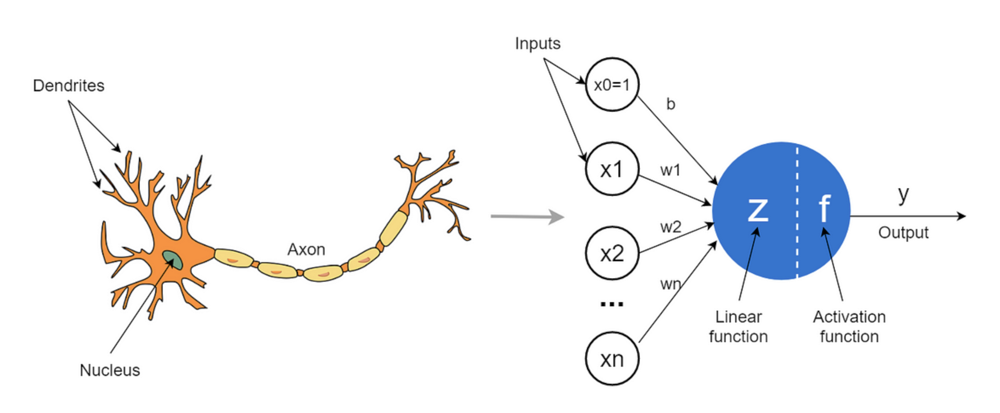
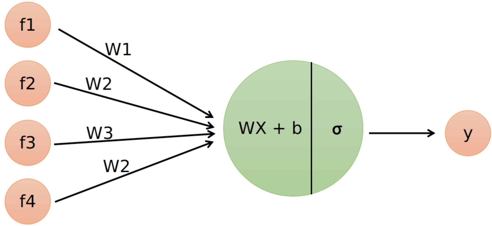
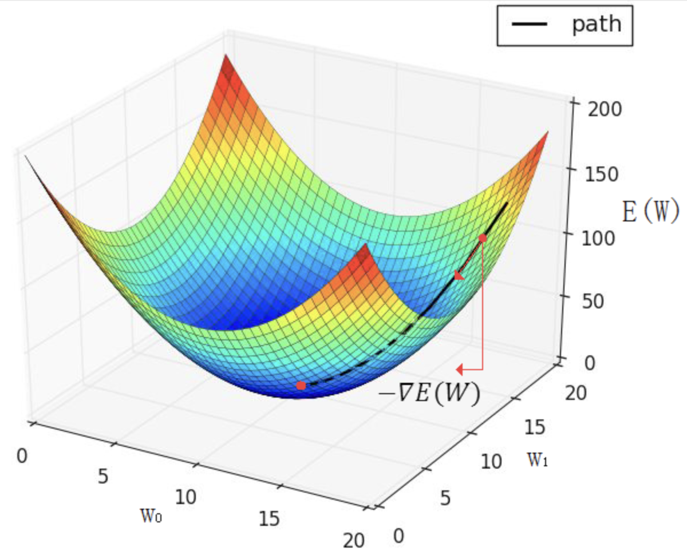
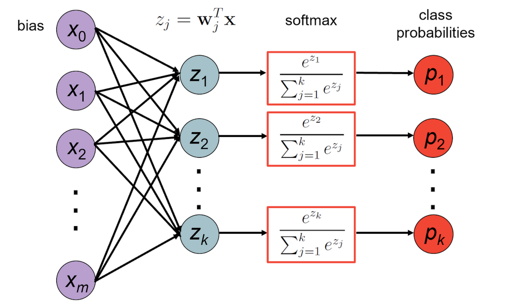

# logistic & softmax regression

> *[Logistic Regression Code](logistic.py) | [Softmax Regression Code](softmax.py)*

If you're familiar with [linear regression](https://www.youtube.com/watch?v=7ArmBVF2dCs), a model where you aim to construct a line of best fit to a set of linear data points ($\vec{X}$) through the equation, $Y = WX + B$, and by iteratively adjusting the model parameters ($\vec{W}$ and $\vec{B}$), it's important to **not**, I repeat, **not,** get logistic or softmax regression confused with fitting a line of to a set of datapoints.


<p align="center">
  <br>
  <span style="font-size:12px;">In essence, this is what linear regression aims to do.</span>
</p>


Logistic regression by itself, is not at all akin to linear regression in terms of outcome.

Rather, for intuition, in [logistic regression](https://www.youtube.com/playlist?list=PLblh5JKOoLUKxzEP5HA2d-Li7IJkHfXSe), the outcome of a model isn't exactly to construct a line of best fit to a set of datapoints but rather to perform [binary classification](https://en.wikipedia.org/wiki/Binary_classification) on a given set of datapoints.

## into logistic regression

In essence, logistic regression involves a combination of an affine transformation and the [`logistic`](https://en.wikipedia.org/wiki/Logistic_function) activation function, which is commonly called *sigmoid* and referenced as $\sigma()$, to perform [binary classification](https://en.wikipedia.org/wiki/Binary_classification).

### **Touching on the logistic sigmoid function**

The `logistic sigmoid` activation function can be mathematically defined as:

$$
\sigma(x) = \frac{1}{1 + e^{-x}}
$$

It's shape takes on a continuous and smooth s-shaped curve, bounded at it's range between $[0, 1]$ and in it's domain, $[-\infty, \infty]$.

<p align = 'center'>
    <br>
    <span style = "font-size:12px">The s-shaped logistic curve</span>
</p>

Within this function, as the denominator grows ever-large, it's final output diminishes to near $0$ while inversely, as the denominator becomes increasingly small, the output converges to a near perfect $1$.

As an example of a near $0$ output, let's take an input $x$ that's extremely negative (at least "extreme" in terms of $\sigma$), for example $-20$:

<div align = 'center'>

$\sigma(-20) = \frac{1}{1 + e^{- (-20)}}$

$\sigma(-20) = \frac{1}{1 + e^{20}}$

$\sigma(-20) = \frac{1}{1 + 485165195.40978}$

$\sigma(-20) = \frac{1}{485165196.40978}$

$\sigma(-20) = 2.06115362\times10^{-9} \approx .00000000206115$

</div>

As you can see, large negative values can lead to a near vanishing output of $\sigma$.

Now for an example of an output that's near $1$, we can take an input $x$ that's positively large, for example, $20$:

<div align = 'center'>

$\sigma(20) = \frac{1}{1 + e^{- (20)}}$ 

$\sigma(20) = \frac{1}{1 + e^{20}}$

$\sigma(20) = \frac{1}{1 + 2.718281828459^{-20}}$

$\sigma(20) = \frac{1}{1.0000000020612}$ 

$\sigma(20) = .99999999793$ 

</div>

And if we want to reach the intermediary value, $.5$, we can define the input as $0$:

<div align = 'center'>

$\sigma(0) = \frac{1}{1 + e^{- (0)}}$

$\sigma(0) = \frac{1}{1 + 1}$

$\sigma(0) = \frac{1}{2} = .5$
</div>

Pretty simple.

Now the gradient of the `logistic sigmoid` function follow a bell shaped curve, akin to the shape of a gaussian distribution:


<div align = 'center'>

</div>


You can notice, as the inputs ($x$-axis) tend to increase towards large postive or negative values, the gradient begins to *vanish*. This *vanishing* is called a *vanishing gradient* which can pose a problem to a model that makes use of this logistic sigmoid activtion function.

>*This will be covered more later.*

So, this logistic sigmoid function makes up only $1$ portion of the logistic regression, it being the latter computation for it to produce a meaningful output.

The former computation is what's known as an *affine transformation*, which as mentioned earlier, is just a simple $Z = WX + B$

> *If you recall from middle / high school algebra...*

This affine transformation is made of 3 variables, where:

<div align = 'center'>

$X:=$ ***The Input Features***

$W:=$ ***The Weight Parameter(s)***

$B:=$ ***The Bias Parameter(s)***

</div>

and $Z$ is commonly known as the weighted sum, which we then feed into the $\sigma$ function, for a final output.

### the forward pass

One entire computation through the affine transformation and logistic sigmoid activation is what is known as a ***forward pass.***

Putting this all together, we can dumb down our entire mathematical flow to this.

<div align = 'center'>

$Z = WX + B$

$\hat{Y} = A = \sigma(Z) = \frac{1}{1 + e^{-Z}}$

*where our activation, $A$, can be defined by $\hat{Y}$, denoting the prediction the logistic regression makes after a forward pass.*
</div>

It's important to note that the multiplication of $W$ and $X$ is the matrix multiplication of each, not an element wise multiplication, at least when $W$ and $X$ are vectorized.

It's also important to know the role of the activation function in a such a model. $\sigma$ is a non-linear function, meaning it's inputs don't correlate to it's outputs. 

Therefore, you aren't bounded to building a **simple linear classifier** that's unable to learn complex features. The introduction of the non-linear activation function allows for a model to learn non-linear features.

Now, at this point, it's useful to introduce the **artificial neuron**.

> *Although, calling it **neuron** can prove to be misleading as it's computation doesn't really resemble the compelxity of a real **neuron***

### the artifical neuron

An artifiical neuron, sometimes referred to as a [perceptron](https://en.wikipedia.org/wiki/Perceptron), serves a a means of packing the above computation into a single describable model.

It's name stems from it's high-level resemblance to a biological neuron, where it's composed of:

1. An Input
2. An Activation
3. A final output

But on a lower level, a real biological neuron is increasingly more complex than an artifiical "neuron", involving neurotransmitters, ion channels, and much more to output continuous signals, not discrete values.

<p align = 'center'>
   <br>
  <span style = "font-size:11px"> A biological neuron vs an artificial neuron</span>
</p>

This model of a single neuron can be used to represent the computation of the logistic regression, as:

<p align = 'center'>
   <br>
  <span style = "font-size:11px"> </span>
</p>

Here, the inputs $X_i$ flow into the individual neuron, where then the affine transformation, $WX + B$ is computed, to then be fed into the $\sigma$ function, then finally outputting $y$ or in our case, will be denoted as $\hat{Y}$.

One pass through this computation can be known as a ***forward pass***.

One last thing to note, is that when computing the final result of this logistic regression model, the $\sigma$ function will provide a value within the range $[0, 1]$. 

To get a final result for binary classification, which is what a logistic regression is designed to compute, you can take the output and apply a thresholding operation where,

<div align = 'center'>

$pred = \begin{cases} 1, p > .5 \\ 0, p < .5 \end{cases}$

</div>

If your labels are originally defined as words, say **cat** and **dog**, you'd typically want to encode the words to be mapped to the numbers $0$ and $1$, so you can accurately compute the **accuracy** and **loss** (the amount of error).

This effectively allows us to classify the predictions of the model to one of the available binary classes.

### computing the loss

The ***loss*** of a logistic regression model is essentially the amount of *error* that the model had during a given forward pass of data.

The loss function plays an invaluable role in our model, as it essentially defines the surface of the search space for our model, to look for the optimal paramters $W$ and $B$ during gradient descent, which we'll cover soon.

<div align = 'center'>

<br>
<em> The surface of a loss function, simplified</em>
</div>

For intuition, the loss function we defined above can define a loss surface as presented in the image above. 

>*Though typically, the more parameters that are introduced into a model, the more complex dimensionality a loss surface has. The above is a simplification of what a loss surface might look like, as it's difficult for us humans to visualize shapes that are $Nth$-dimensional, above **3D***.

A model will aim to minimize the value of the loss function, to reach a global optima of the given surface, which in the image above, can be represented by the deep blue region.

It's at this deep blue region, where a model would have learnt the optimal parameters for making accurate predictions.


While in linear regression, you might've seen the loss to be computing using the mean absolute error or mean square error functions, in logistic regression we can compute the loss by using what's known as the ***binary cross entropy loss function.***

This function takes in $Y$, which is the true label for a given input feature and $\hat{Y}$, which is the model's output, aiming to predict $Y$.

$L(Y, \hat{Y}) = - Y \cdot ln(\hat{Y}) - (1-Y) \cdot ln(1-\hat{Y})$

Within this function, if our label $Y$ is denoted as $0$, we effectively cancel out the first portion, $-Y \cdot ln(\hat{Y})$ due to a multiplication of $ln(\hat{Y})$ by $0$. 

Therefore, we'd only compute: $- (1 - Y) \cdot ln(1 - \hat{Y})$.

>*Note that $\hat{Y}$ is the raw output of the $\sigma$ within range $[0,1]$, not the binary thresholded value $0$ or $1$*

Now for example if our $\hat{Y}$ turnt out to be the value $.24$, our loss would be computed as:

<div align = 'center'>

$L(0, .24) = - (1 - 0) \cdot ln(1 - .24)$

$L(0, .24) = -1 \cdot ln(.76)$

$L(0, .24) = -1 \cdot -0.2744368457017603$

$L(0, .24) = 0.2744368457017603$

</div>

On the flip side, if our label $Y$ was denoted as $1$, we can cancel out the second portion of the equation, $(1 - Y) \cdot ln(1 - \hat{Y})$, as $(1-Y)$ would bring a multiplication of $0$ with $ln(1 - \hat{Y})$

So now, if our predicted class label, $\hat{Y}$, was $.82$, our loss would be computed as:


<div align = 'center'>

$L(1, .82) = - 1 \cdot ln(.82)$

$L(1, .82) = 0.19845093872383832$
</div>

If you're curious to get a look into a code implementation, in `numpy`, this loss function can be simply defined as:

```
Loss = -Y * np.log(Y_hat) - (1 - Y) * np.log(1 - Y_hat)
```

### the backward pass

The backward pass of the model is an essential prerequisite to compute, in order to then allow for a logistic regression model to learn or train by continuously adapting it's weights to minimize the value of the loss function.

The backward pass involves the caluculation of gradients (aka derivatives) of the given loss function with respect to a set of parameters, $\theta$, which in our case, will be $W$ or $B$.

This process is done through the chain rule.

> *This is where high school calculus comes in handy*

To compute the gradients for $W$ or $B$ (I'll use $\theta$ to represent either), we have to dig all the way back by computing the gradients of earlier variables prior.

The entire calculation will look as:

$\frac{∂L(Y, \hat{Y})}{∂\theta} = (\frac{∂L(Y, \hat{Y})}{∂\hat{Y}})(\frac{∂\hat{Y}}{∂Z})(\frac{∂Z}{∂\theta})$

So to find the gradients of the loss with respect to $W$ and $B$, we'd first need to compute the gradients with respect to the outermost variables, which in our case is $\hat{Y}$ and $Z$.

So in the case of logistic regression, where we use the binary cross entropy loss, $L(Y, \hat{Y}) = - Y \cdot ln(\hat{Y}) - (1-Y) \cdot ln(1-\hat{Y})$, and the $\sigma$ activation function, $\frac{1}{1 + e^{-z}}$, we'd take the gradient of $L(Y, \hat{Y})$ with respect to $Z$ to get our first gradient.

**We'll refer to the gradient $\frac{∂L(Y, \hat{Y})}{∂Z}$, as $∂Z$ and $\frac{∂L(Y, \hat{Y})}{∂Z}$ as $∂\hat{Y}$  to make things clear.**

This calculation of $∂Z$ implicitly computes $∂\hat{Y}$, so we can avoid the stand along calculation of $∂\hat{Y}$.

$∂Z = \frac{∂L(Y, \hat{Y})}{∂Z} = (\frac{∂L(Y, \hat{Y})}{∂\hat{Y}})(\frac{∂\hat{Y}}{∂Z}) = \hat{Y} - Y$

> *To keep things simple, we won't be deriving the full gradient with respect to $Z$ here.*

So referring back to our original equation of the chain rule, 
$\frac{∂L(Y, \hat{Y})}{∂\theta} = (\frac{∂L(Y, \hat{Y})}{∂\hat{Y}})(\frac{∂\hat{Y}}{∂Z})(\frac{∂Z}{∂\theta})$, now that we have $∂Z$, we can use the chain rule to calculate the gradients with respect to $W$ and $B$.

$∂W = (∂Z)(\frac{∂Z}{∂W}) = (\hat{Y} - Y) \cdot X^T$

$∂B = (∂Z)(\frac{∂Z}{∂B}) = (\hat{Y} - Y) \cdot 1$

Now, these gradients $∂W$ and $∂B$, will play an important role in the update rule of our model, finalizing one pass of gradient descent.

### weight updates

The gradients that were computed earlier can be used to update the parameters $W$ and $B$, through what's called the update rule.

This update rule is defined as - $\theta = \theta - \alpha \cdot ∂\frac{∂L(Y, \hat{Y})}{\theta}$  - where $\alpha$ is the ***learning rate*** or our model.

The *learning rate* plays an essential role in defining how fast or how slow our model is able to learn over time.

We can't set the learning rate to be too high, or else our model won't be able to effectively converge on a global minima of the loss surface as it'll begin to overshoot past. Inversely, setting the learning rate too low might cause slow and inefficient training.

> *There are many more nuances to setting a learning rate but for now, that's all that matters.*

So, in our case where we have parameters $W$ and $B$, we can define the weight updates as:

<div align = 'center'>

$W = W - \alpha \cdot \frac{∂L(Y, \hat{Y})}{∂W}$

$B = B - \alpha \cdot \frac{∂L(Y, \hat{Y})}{∂B}$

</div>

This weight update allows for the parameters $W$ and $B$ to be updated in such a way that the model begins to minimize the value of loss, optimizing for a global minimum, ultimately increasing it's accuracy as a byproduct.

So, up until now, we've computed a single pass of *gradient descent*, comprised of a ***forward pass*** and a ***backward pass***.

### gradient descent

Gradient descent is built upon the foundations just covered, the forward pass, the backward pass, and the weight updates.

One iteration of gradient descent is represents one pass through this entire process.

This is typically done for multiple iterations, as much as need be, as the more iterations gone through a pass of gradient descent,  the more 'fit' or trained a model will typically be to a dataset.

So to put this all together, one pass of gradient descent for `logistic regression` can be mathematically defined (with some pseudocode) as:

>*Where one epoch is a single pass through your entire dataset.*

<div align = 'center'>

$for \:\: epoch \:\: in \:\: range(epochs):$

$Z = WX + B$

$\hat{Y} = A = \sigma(Z) = \frac{1}{1 + e^{-Z}}$

$Loss = - Y \cdot ln(\hat{Y}) - (1-Y) \cdot ln(1-\hat{Y})$


$∂Z = (\frac{∂L(Y, \hat{Y})}{∂\hat{Y}})(\frac{∂\hat{Y}}{∂Z}) = \hat{Y} - Y$
3
$∂W = (∂Z)(\frac{∂Z}{∂W}) = (\hat{Y} - Y) \cdot X^T$

$∂B = (∂Z)(\frac{∂Z}{∂B}) = (\hat{Y} - Y) \cdot 1$

$W = W - \alpha \cdot \frac{∂L(Y, \hat{Y})}{∂W}$

$B = B - \alpha \cdot \frac{∂L(Y, \hat{Y})}{∂B}$

$return \:\: W, B$
</div>

Now, to effectively trian your model, you'll need to run it for a set number of epochs until it converges to your the global optima of the loss for your datset.

**You can check out a coded implementation [here](logistic.py), to see how you might be able to practically build a model out.**

## into softmax regression

> *[Softmax Regression Code](softmax.py)*

Softmax regression is essentially an extension of logistic regression that aims to classify the set of given samples to more than 2 classes, essentially now performing multiclass classification, not binary classification.

This extension is purely brought upon by a modification to the $\sigma$ activation function that generalizes it to computing the probability of multiple classes being the correct label $Y$.

Where you see the $\sigma$ being defined as $\frac{1}{1 + e^{-z}}$, we can now call our new activation function, now called the ***softmax*** activtaion function, defined as:

<div align = 'center'>

$\tilde{\sigma}(z) = \frac{e^z}{\sum{e^z}}$<br>
<em style = 'font-size: 12px'>$\tilde{\sigma}$ being the softmax</em>
</div>

The modification to the $\sigma$ equation, to turn it into ***softmax*** ($\tilde{\sigma}$), allows for the computation of the probabilities for multiple classes.

The calculation of $e^z$ in the numerator, computes the probability for each class within $z$ while the summation of $e^z$ as $\sum{e^z}$, calculates the sums of all probabilities for all classes within $z$.

The division of the $e^z$ by $\sum{e^z}$ allows for the calculation of the normalized logits / probabilities, which our model calculated, that a given sample belongs to a given class indexed by $z$.

Let's say the output logit, $z$, has the dimensions of $(classes, samples)$, where each value along the first axis, $classes$, denotes the unnormalized probability of a sample belonging to a given class.

So in this case, when you take the summation of $e^z$, you'd sum over the first axis as you want to calculate the probabilities over the number of total classes

> *Of course, in practice you might have $(samples, classes)$ instead, in which you'd sum over the second axis instead.*

So ultimately to sum things up, the softmax equation, $\frac{e^z}{\sum e^z}$, allows us to normalize the output logit, $z$, to a probability within the range $[0, 1]$, which can be easily interpretable as a percentage value (%).

In practice, given that the final output is represented in terms of probability, to get a true prediction during inference or testing, you'd want to take the $argmax$ of the output vector, which essentially returns the index of the highest value within the output vector.

For example, say the output, denoted as $\hat{Y}$, was a vector of:

<div align = 'center'>

$[.12, .8, .08]$

</div>

Taking the $argmax$ of the vector, $\hat{Y}$, would return $1$, denoting the index of the class with the highest probability.

If your labels, as an example, $[cat, dog, bear]$, are encoded into integer representations, $[0,1,2]$  the prediction $1$ will be able to represent the $2$nd class of your dataset (given that indices typically begin with $0$).

So the final prediction would be **dog** given that it's the **2nd** class.

### modifying the loss function

We can also modify the loss function to a more simplistic function called ***categorical cross entropy*** which in turn, generalizes the loss calculation to all our classes.

This can be defined as:

<div align = 'center'>

$L(\hat{Y}, Y_{onehot}) = Y_{onehot} \cdot ln(\hat{Y})$

</div>

The difference here is that $Y$, rather than taking the form of raw labels, takes the form of one hot encodings of the labels $Y$. 

Essentially, a one hot encoding is a vector of $0$s and a singular $1$. The index where the singular $1$ is located, identifies our true label.

If I had the one hot encoding of $[0, 0, 0, 1]$, my label would be defined as $3$, as the singular $1$ is located at the $3$rd index of the one hot encoding.

If I had the one hot encoding of $[1, 0, 0, 0]$, my label woudl be defined as $0$, as the singular $1$ is located at the $0$th index of the one hot encoding.

> *Read more about one hot encodings here*

Now, here's a visual for easier understanding of the flow of the softmax regression.

<div align = 'center'>
</img><br>
<em></em>
</div>

<br>

The computation of the softmax isn't too different from the original logistic regression in terms of flow, besides the new activation function, modification to the loss, and introduction of the one hot encoding.

It can be defined as (with of course, the new function, $\tilde{\sigma}$):

<div align = 'center'>

$for \:\: epoch \:\: in \:\: range(epochs):$

$Z = WX + B$

$\hat{Y} = A =\tilde{\sigma}(Z) = \frac{1}{1 + e^{-Z}}$

$Loss = Y_{onehot} \cdot ln(\hat{Y})$

$∂Z = (\frac{∂L(Y, \hat{Y})}{∂\hat{Y}})(\frac{∂\hat{Y}}{∂Z}) = \hat{Y} - Y_{onehot}$

$∂W = (∂Z)(\frac{∂Z}{∂W}) = (\hat{Y} - Y_{onehot}) \cdot X^T$

$∂B = (∂Z)(\frac{∂Z}{∂B}) = (\hat{Y} - Y_{onehot}) \cdot 1$

$W = W - \alpha \cdot \frac{∂L(Y_{onehot}, \hat{Y})}{∂W}$

$B = B - \alpha \cdot \frac{∂L(Y_{onehot}, \hat{Y})}{∂B}$

$return \:\: W, B$
</div>

**To take a dive into it's implementation, check out the code [here](softmax.py)**