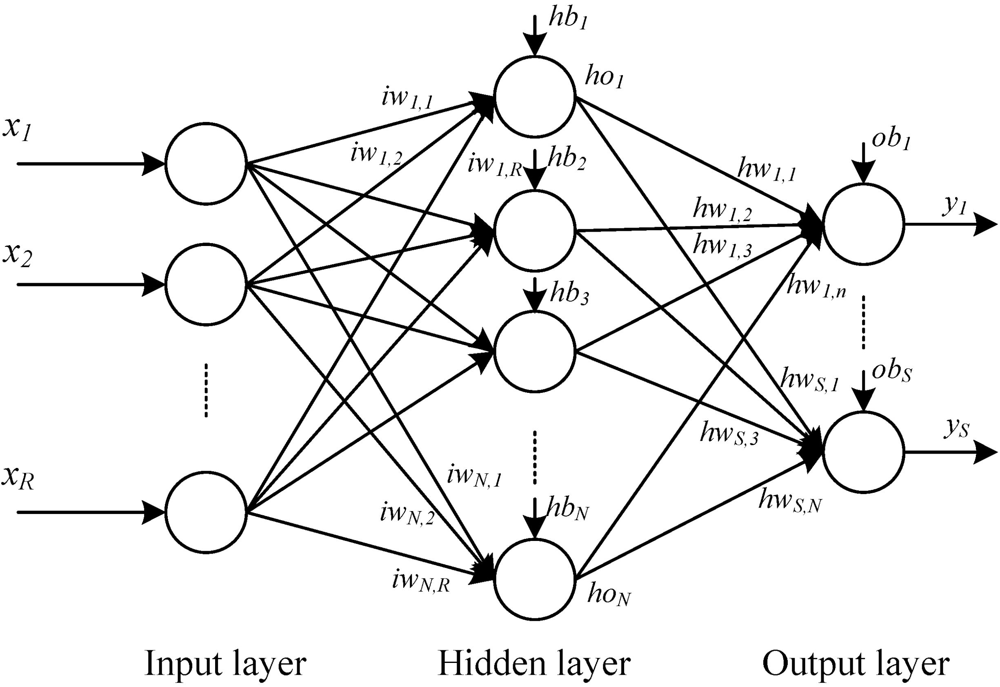

## into neural nets

> *[Code](nn.py)*

Note that the foundations foundations of the [logistic & softmax regression](../01-logistic-&-softmax-regression/README.md) serve as similar foundations for the architectures of neural networks, the difference being that neural networks are **deep** and **complex**.

### the architecture

Revisiting the model of an artificial neuron:

</img>

It can be recalled that a neuron takes in a set of input features, in the image above defined as $f_i$. 

In our case, we'll be defining these inputs as $X_i$, $i$ denoting the index of the feature.

The neuron takes in the set of inputs, $X_i$, applies the affine transformation $WX + B$ and then applies an activation function, either $\frac{1}{1 + e^{-z}}$ (sigmoid) or $\frac{e^{z}}{\sum{e^z}}$ (softmax), depending if you're performing binary classification or multi-class classification, to then output a final value which we'll denote as $\hat{Y}$.

A ***neural network*** has a similar flow in it's forward pass, but just as mentioned earlier, it's a lot more ***deep*** and ***complex***.

What is meant by ***deep*** and ***complex*** is, it contains more ***neurons*** and more ***layers***.

Here's a diagram for reference:

</img>  
Note: Most definitely, <b>not to scale</b>

 

Discussing the layers, the left-most layer of this neural network is simply called the ***input layer***. 

This input layer isn't really a layer of the network itself, it's rather a representation of a set of input features to the ***first hidden layer***, where each node is representative of a single input feature.

> [!NOTE]
> *A single input feature, for example, can be a single pixel value of an image*

### the forward pass

Now, every single node / input feature within the input layer is fed into every single neuron individually in the first hidden layer.

> [!NOTE]
> *Typically, the input layer isn't considered as part of the total layer count nor is even called a layer at times. So here, when a "first layer" is mentioned, we'll be referring to the first hidden layer of a neural network, not the input layer*

In prior single neuron examples, an affine transformation was computed to then be fed into an activation function to get a final output.

When we feed an input feature into a neuron in the hidden layer of the network, the same exact process occurs, but per neuron.

In our case though, we'll be replacing the $\sigma$ activation function for a $ReLU$ activation. 

The rationale behind this being that $\sigma$ can prove to be unstable for deep neural networks, given that they're prone to vanishing gradients, and are more expensive to compute given $e$.

### TODO
- [ ] Add link to activation functions page to serve as an explanation

> [!NOTE]
> *For the following, it'll be assumed that all inputs, to both the hidden layer and output layer are **vectorized** outputs of a previous layer denoted by a capital variable.*
> 
> *In this case, the inputs are then matrices of dimensions - $(n_{in}, samples)$- where $n_{in}$ are the number of input features to a given layer*.
>
> *To learn more about vectorization, check out this amazing [resource](https://youtu.be/qsIrQi0fzbY).*

$for \: each \: neuron,\:n,\: in\: hidden \: layer:$

$z_1^n = w_1^nX + b_1^n$

$a_1^n = ReLU{(z_1^n})$  
The subscript $1$, denoting the first hidden layer.

Then, the outputs of the hidden layer, $A_1$ in vectorized form for all neurons $n$, are fed into the output layer where the same process, an affine transformation and a non-linear activation, in this case will be softmax ($\tilde{\sigma}$), take place to allow for a final output.

$for \; each \: neuron,\:n, \:in \:output \: layer$

$z_2^n = w_2^nA_1 + b_2^n$

$\hat{Y} = a_2^n = \tilde{\sigma}(z_2^n)$

It's important to note, given that we're using the softmax function, the final output is represented in terms of probability.

Just as prior in softmax regression, where we take take the $argmax$ of the final output vector, to get a final class prediction, we can do the same here.

$pred = argmax(A_2)$

This value $pred$, given that your labels, $Y$, are encoded into integer representations, can be used to compute an accuracy by averaging the amount of times where $pred = Y$ is true over the number of samples in your dataset

$accuracy = \frac{\sum{pred == Y}}{samples}$   
Pseudo code for computing accuracy, where $\hat{Y} == Y$ would return a boolean value.

> [!IMPORTANT]
> *When training a neural network, you typically wouldn't use the $argmax$ed values to computed the loss or to compute gradients to train the model. You'd want to use the raw outputs, $A_2$ as a means to calculate the loss and the gradients as it's more representative of the true outputs of the neural network.*

So now, given the above, we can define a full forward pass of a neural network as:

> [!NOTE]
> ***Note** that from now, all inputs and output values, and paramters will be expressed in [vectorized](https://youtu.be/qsIrQi0fzbY) formats.*

$Z_1 = W_1X + B_1$ 

$A_1 = ReLU(Z_1)$

$Z_2 = W_2A_1 + B_2$

$A_2 = \tilde{\sigma}(Z_2)$

Now again, as prior, we can compute the loss using the, ***categorical cross entropy loss function***, just as prior in softmax regression.

$L(\hat{Y}, Y) = Y_{onehot} * ln(\hat{Y})$  
Again, where $Y_{onehot}$ are the one-hot encoded labels.

### the backpropagation

Just as prior, backpropagation involes the calculation of the gradients of the loss, $L(\hat{Y}, Y)$, with respect to the given parameters, in this case being $W_1$, $B_1$, $W_2$, and $B_2$.

> [!NOTE]
> *I'll be interchangeably using $\theta_l$ to denote either parameters at the $l$th layer*

And again, just as prior, this involves the use of the chain rule of calculus.

To compute the gradients with respect to parameters in layer 2, $\frac{∂L(\hat{Y}, Y)}{∂\theta_2}$, and with respect to parameters in layer 1, $\frac{L(\hat{Y}{Y})}{∂\theta_1}$, we'll have to dig all the way back through the chain rule by computing the gradients of earlier variables.

For the parameters of the second layer, this will look as:

$\frac{L(\hat{Y}, Y)}{\theta_2} = (\frac{L(\hat{Y}, Y)}{∂A_2})(\frac{∂A_2}{∂Z_2})(\frac{∂Z_2}{∂\theta_2})$

For the parameters of the first layer, this will look as:

$\frac{L(\hat{Y}, Y)}{\theta_1} = (\frac{L(\hat{Y}, Y)}{∂A_2})(\frac{∂A_2}{∂Z_2})(\frac{∂Z_2}{∂A_1})(\frac{∂A_1}{∂Z_1})(\frac{∂Z_1}{∂\theta_1})$

This might seem complicated at first, but can all be dumbed down into simpler derivations, which can be understood with basic knowledge of calculus..

When computing, $(\frac{∂L(\hat{Y}, Y)}{∂A_2})(\frac{∂A_2}{∂Z_2})(\frac{∂Z_2}{∂\theta_2})$, we'd need to find $\frac{∂L(\hat{Y},{Y})}{∂Z_2}$ prior.

Now $\frac{∂L(\hat{Y},{Y})}{∂Z_2}$, can be simplified to $A_2 - Y_{onehot}$
> [!NOTE]
> *To keep things simple, I won't be going over this derivation here.*

Given this, what's left is finding the value of $\frac{∂Z_2}{∂\theta_2}$, which differs depending on the parameter we're regarding to.

Let's say we try to calculate the gradient with respect to $W_2$.

Given the original equation in the forward pass:

$Z_2 = W_2A_1 + B_2$

the gradient, $\frac{∂Z_2}{∂W_2}$ ends up being equal to $A_1$, given that the derivative of $W_2$ is $1$ and $B_2$ cancels out as it's a constant in reference to the gradient.

> [!NOTE]
> *If you've previously learnt calculus, this might come off as fairly easy, which it can be at times.* 

So ultimately our equation for $\frac{L(\hat{Y}, Y)}{∂W_2}$ will look like:

$\frac{L(\hat{Y}, Y)}{W_2} = (A_2 - Y_{onehot}) \cdot A_1^T$

> *We're taking the transpose of $A_1^T$, as in the forward pass we've previously computed a matrix multiplication with $W$, which implicitly involves a matrix transpose.*
> 
> *This is where linear algebra might come in handy*