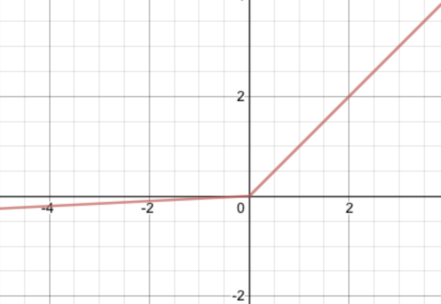

## activation functions

> Checkout the implementations for each activation function in this [Jupyter Notebook](ActivationFuncs.ipynb)

So far, the discussed activation functions have been sigmoid ($\sigma$), softmax ($\tilde{\sigma}$), and $ReLU$. Other ones include $Leaky$&nbsp;$ReLU$, $tanh$, $PReLU$, $SeLU$, and many more. 

These all come with their unique properties that make some useful for specific scenarios and others not, which all depends on the type of model being built.

But each activation function should have a key set of needed features that allow for effective learning and efficient computation.

<details><summary> <b>Non-linearity</b> </summary>
The introduction of nonlinearity given by an activation function is extremely important for a neural network as it allows for it to capture complex features and datapoints from a set of inputs. 

Without activation functions, a neural network would essentially be a set of linear classifiers, unable to produce quality results to solve complex problems.</details>


<details><summary> <b>Range</b> </summary>
Activation functions have different ranges, some ranging from 0 to 1, others from 0 to infinity, and others from 1 to 1.

The output range of an activation function can be important to consider, for a variety of factors. 
	
It's range can affect the scale of gradients during backpropagation leading to exploding or vanishing gradients, the numerical stability, and the interpretability of an activation function (some, such as softmax, can be seen as a probability).</details>


<details><summary> <b>Monotonicity</b> </summary>Monotonicity, ensures that as the input of a model changes, the output remains consistently moving in a given direction (increasing or decreasing), which alongside it's smoothness is essential to a good loss function.

If a function isn't monotonic, the gradient sign may change irregularly over different inputs which can then lead to the model converging to the wrong set of parameters at a local minima instead of a global minima. This then makes the model less interpretable in how it learns.</details>

<details><summary> <b>Continuity</b> </summary>Continuity in an activation function allows for smooth continuous changes. 
    
As the inputs change, the outputs change slightly. This becomes important for ensuring smooth gradient descent computations during backpropagation. 
    
A lack of continuity, would imply that an activation function isn't differentiable at a given point, which may ultimately break the backpropagation and gradient descent.
</details>

	
<details><summary> <b>Differentiability</b> </summary>Differentiability allows for gradient based optimization algorithms (backpropagation) to properly allow gradients to be computed for the weight updates. 

If differentiability wasn't the case within the domain of an activation function, it's possible that NaN values begin to propagate throughout a model.</details>

<details><summary> <b>Sparsity</b> </summary>The sparsity of activation functions can be beneficial when looking for more efficient computations. The more sparse an activation function is, the less computations it might have to compute in order to reach it's output, then also leading to better memory efficiency.

Sparsity can also improve regularization. By encouraging neurons to be inactive at $0$, it reduces complexity which in certain contexts can mitigate overfitting and improve generalization.

Too much sparsity, on the other hand, can limit the power of a model to learn complex and nuanced patterns in a dataset. 

An activation function should be sparse enough to provide efficient computations and good regularization.</details>

<details><summary> <b>Computational Complexity</b> </summary>	The more computationally expensive an activation function is to compute, the slower a neural network will take to learn and then provide inference. 

It's better to use activation functions that are computationally efficient, in order to speed up the learning process and save valuable resources.</details>

> [!NOTE]
> *I'll only be covering the foundational activation functions, here. There's so much more out there, such as [GeLU](https://paperswithcode.com/method/gelu), [SeLU](https://paperswithcode.com/method/selu), and [more](https://stats.stackexchange.com/questions/115258/comprehensive-list-of-activation-functions-in-neural-networks-with-pros-cons)*.

### σ

> [Code](ActivationFuncs.ipynb#cell-2)

The sigmoid activation, $\sigma$ as discussed prior, is defined as $\frac{1}{1 + e^{-z}}$.

The function is shaped as an S-shaped curve, in the range of $0 < \hat{y} < 1$, one of it's use cases being to compute an output as a probability of an input belonging to a given class, within binary classification.

<div align = 'center'>

</div>

It's derivative can be defined as:

<div align = 'center'>

$σ(z) = \frac{e^z}{e^z + 1}$

$σ(z) = (1+e^{-z})^{-1}$

$σ'(z) = - (1 +e^{-z})^{-2}(-e^{-z})$

$σ'(z) = - \frac{-e^{-z}}{(1 +e^{-z})^{2}}$

$σ'(z) = \frac{e^{-z}}{(1 +e^{-z})^{2}}$

</div>

Sigmoid can be considered a smooth function, given that it's derivative is continuous for all real values of $z$, making it proper for using optimization algorithms such as gradient descent.

It's also a monotonically increasing function, with no abrupt changes in it's sign value. This then allow for a model to better converge onto a global minima.

Regarding it's computational efficiency, given that it contains the exponential function, $e^z$, it's computationally expensive given that it requires *["hundreds of addition, subtraction, multiplication, and division instructions on a general-purpose CPU"](https://www.sciencedirect.com/topics/computer-science/sigmoid-function#:~:text=High%20computational%20complexity.,Thus%2C%20the%20computation%20is%20inefficient).*

Though, nearing $0$ and $1$, it's gradient is very small. 

This becomes a problem in deeper networks, where to get the gradients of earlier layers through backpropagation and the chain rule, we need to multiply the gradient of the output layers with earlier layers. 

Given that sigmoid yields a small gradient when it converges to near $0$ or $1$, the deeper we get into a network, the smaller a gradient will be in earlier layers, then leading to slower learning and convergence

### Softmax

> [Code](ActivationFuncs.ipynb#cell-3)


Just as was covered prior, the softmax activation function can be defined as, $\frac{e^z}{\sum e^z}$.

The range of softmax is from $0$ to $1$, outputting a probability of an input belonging to a specific class. 

It being bounded between this rasnge makes it suitable for the computation of a probability, as it also divides the exponential, $e$, raised to given class $z$, over the sum of $e$ raised to all classes $z$. 

Therefore, function requires the output of all classes to be equal to $1$, reinforcing it's use for computing a probability.

Softmax is also smooth everywhere, unlike ReLU and it's variants. This allows for backpropagation to work effectively throughout the entire network ultimately mitigating the propagation of NaN values throughout a model.

It's continuity allows for gradient descent to slowly update parameters in a continuous fashion with no abrupt changes. Being monotonically increasing then allows for easier interpretability of the learning behavior of a model.

Softmax is less computationally efficient than most activation functions such as ReLU, sigmoid, 
or tanh, but it's primarily used in the output layers of a model making this not much of an issue.

Common use cases of softmax are primarily only multi-class classification problem, being used in the final output layer. Going more complex, it can be used in attention mechanisms to compute the attention weights.

The cool thing about using $e$ in softmax, is the exponential increase in output it has in relation to an increase to inputs. 

Say we're aiming to optimize for the one hot encoded label, $[0, 1, 0, 0]$.

If a model has a normalized logit of: $[.2222, .4444, .2222, .1111]$ as the final output, it's clear that the $armgax$, despite it being greater than the rest of the values, isn't very high compared to the rest as it should be. This might make it harder for a model to get accurate predictions consistently.

But if we introduce the softmax, and we raise those values to $e$, the outputs end up being: $[0.1025,0.7573,0.1025,0.0377]$, where it's clear that the $argmax$ is closer to the true class label, which then provides an increase in accuracy as a model is trained.

### TanH

> [Code](ActivationFuncs.ipynb#cell-4)

The hyperbolic tangent resembles $\sigma$, but has a range instead between $[-1, 1]$ rather than $[0,1]$.
<br><br>
<div align = 'center'>

</div>
<br>
It can be defined as:

<div align = 'center'>

$TanH = \frac{e^z - e^{-z}}{e^z + {e^{-z}}}$
</div>

while it's derivative can be defined as:

<div align = 'center'>

$TanH'= \frac{(e^z + e^{-z})(e^z - e^{-z})' - (e^z - e^{-z})(e^z + e^{-z})'}{({e^z + e^{-z}})^2}$

$TanH'= \frac{(e^z + e^{-z})^2 - (e^z - e^{-z})^z}{(e^z + e^{-z})^2}$

$TanH'= \frac{(e^z + e^{-z})^2}{(e^z + e^{-z})^2} - \frac{(e^z - e^{-z})^2}{(e^z + e^{-z})^2}$

$TanH'= 1 - tanh(z)^2$

</div>

It's range is between, $-1$ and $1$ symmetric around the origin of $0,0$, which ends up yielding a steeper gradient than the $\sigma$ function.

The $TanH$ function is smooth and continuous everywhere, making it differentiable amongst it's entire range.

The smoothness enables backpropagation to effectively compute the gradients and update a model's parameters without issues of numerical instability while the continuity enables a smooth gradient descent mitigating sudden and abrupt changes in the model parameters.

Being a monotonically increasing function, there are no abrupt changes in it's sign making the learning during Backpropagation smooth and interpretable.

The computational efficiency of tanh is a burden, requiring the computation of multiple 
 `np.exp`'s, more than $\sigma$. 

### ReLU

> [Code](ActivationFuncs.ipynb#cell-5)

$ReLU$ is an activation function that's $0$ when $z < 0$ and linear when $z > 0$.

<div align = 'center'>

</div>

Mathematically, it's defined as:

<div align = 'center'>

$ReLU(z) = \begin{cases} z, z>0 \\ 0, z<0 \end{cases}$

$ReLU(z) = max(0, z)$

</div>

while it's derivative looks like:

<div align = 'center'>

$ReLU'(z) = \begin{cases} 1, z>0 \\ 0, z<0 \end{cases}$
</div>

The range of ReLU is from $0$ to $\infty$, providing a stable output of $0$ if the input $z$ is less than $0$ and a linear output of $z$ is the input $z$ is greater than $0$. 

Given that it isn't bound to a specific range such as $\sigma$ or $tanh$, it's use case will not be for normalizing data between fixed range, which can be inefficient when calculating final outputs given a lack of interpretability. Like $\sigma$ can be used to calculate probabilities, $ReLU$ can't be interpreted as such.

But it doesn't suffer from the vanishing gradient problem. Rather it's sparse when $z < 0$ and has a consistent output when $z > 0$.

> *Though, introducing sparsity might lead to 'dying neurons', which can also inhibit learning. You typically mitigate this through a modification to ReLU called Leaky ReLU.*

$ReLU$ is not a 'smooth' function throughout it's entire range. At $0$, $ReLU$ is not differentiable, which can potentially cause problems, but it's unlikely that an input will be exactly $0$ due to the linear combination and the addition of a bias parameter, $B$ in the affine transformation prior.

In practice, the discontinuity can be easily done away with, by simply letting $ReLU$ be equivalent to $0$ when $z$ is $0$

<div align = 'center'>

```
numpy.maximum(z, 0)

'''
This returns z, when z is greater than 0. If z <= 0, the function will return 0.
'''
```
</div>

$ReLU$ is a strictly monotonically increasing function. As the inputs increase, the activations gotten with $ReLU$ will linearly increase when $z > 0$, then helping the training of a model become more predictable.

$ReLU$ is also more computationally efficient than most activation functions such as $\sigma$ or $tanh$. It's simple use of the $max()$ function and absence of Euler's $e$, makes for computationally efficient operations.

Given it's lack of suitability for output layers, with it's unbounded upper range, it's lowered computational complexity, and avoidance of the Vanishing Gradient problem, $ReLU$ is commonly used in the hidden layers of a deep network, especially when sparsity is desired.

### Leaky ReLU

> [Code](ActivationFuncs.ipynb#cell-6)

$Leaky$ $ReLU$ is an activation function based on ReLU with the difference being that when $z < 0$, it has a small gradient rather than having a $0$ gradient.
<br><br>
<div align = 'center'>

</div>
<br>

Mathematically, it is defined as:

<div align = 'center'>

$LeakyReLU(z) = \begin{cases} z, z>0 \\ 0.01z, z<0 \end{cases}$

$LeakyReLU(z) = max(.01z, z)$

</div>

The derivative of Leaky ReLU can be defined as:

<div align = 'center'>

$LeakyReLU'(z) = \begin{cases} 1, z > 0 \\ .01, z < 0 \end{cases}$
</div>

The range of $Leaky$ $ReLU$ goes from $-\infty$ to $\infty$. Given this purely unbounded range, unlike ReLU, it isn't prone to 'dead neurons'. 

Rather having a smaller gradient of $.01$ when $z < 0$, is allows for a model to learn despite outputting negative values.

Just like $ReLU$, $Leaky$ $ReLU$ isn't smooth everywhere as it isn't differentiable when an input $z$ is equal to $0$. 

Mathematically, this discontinuity may post a problem. But inputs typically aren't $0$ given that the weighted sum involves a linear combination and the addition of a bias parameter. 

And again, can be bypassed in practice just like this:

<div align = 'center'>

```
a = np.where(z > 0, z, .01 * z)

'''
This returns z, when z is greater than 0. If z <= 0, the function will return (.01 * z).
'''
```
</div>

The function is strictly monotonically increasing with no abrupt changes in it's sign value. This then prevents the gradient descent from converging onto a local minima rather than a global one, allowing for effective learning over time.

$Leaky$ $ReLU$ is more computationally complex than $ReLU$, given the addition of a multiplication but still way more computationally efficient than $\sigma$ and $TanH$ given the absence of Euler's number, $e$.

Common use cases include activations at the hidden layers of deep networks. It's lack of computational complexity, ability to cope with vanishing gradients, lack of extreme sparsity, and unbounded range make it an improved activation function for hidden layers.

> [!IMPORTANT]
>***Feel free to checkout the files, [nn.py](nn.py) or [MiniBatchNN.py](MiniBatchNN.py) and replace the `ReLU` activation function and it's derivative `ReLU_deriv` with any of the above to test them out.***
