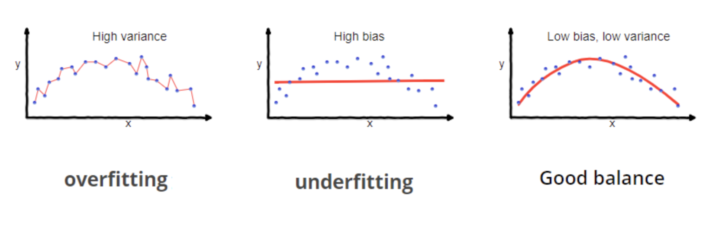
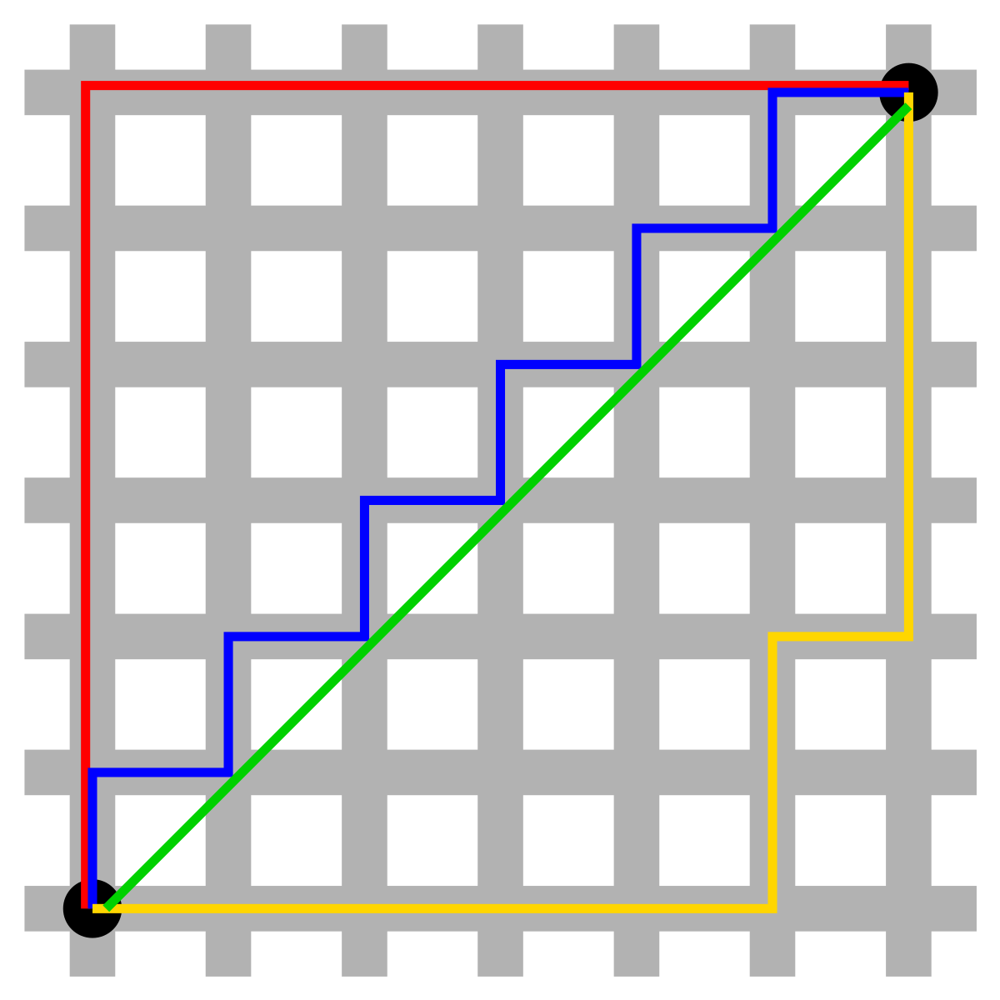

# Regularization

> *[L1 Regularization Code](L1NN.py) | [L2 Regularization Code](L2NN.py) | [Dropout Regularization Code](DropoutNN.py)*

Regularization proves to be another essential aspect when training neural networks.

Intuitively at first, one might think that it makes logical sense to maximize the accuracy and minimize the loss of a model on training datasets, to then maximize the model performance during testing and inference.

But the samples used in testing datasets and especially during inference are likely to be samples that were previously unseen by a model.

If a neural network ***overfits*** and aligns its predictions too precisely on the testing data, it won't be able to effectively extrapolate it's predictions to unseen data.

This is called a lack of model generalizability.

Let's define two things, ***bias*** and ***variance*** in a model.

**Bias** is the error in a model's prediction that occurs when the model is too simple to capture complex patterns and relationships in a dataset.

**Variance** is the variability in error that occur's in a model's predictions on unseen data. If a model is too ***overfit*** on a training set, it'll have high variability in it's performance on unseen data, indicating a high ***variance***.

 

</img>

Increasing model generalizability is about finding the optimum balance between the **bias** and **variance** of the model, you want your model to be complex enough to make good predictions (**low bias**) but generalizable enough to perform well on unseen data (**low variance**).

Of course, sometimes there's a tradeoff between the two, you can't fully optimize for one without degrading the other, but unique ***regularization methods*** have came about that allow for exceptional model performance while still allowing for a good balance between the **bias** and the **variance**.

These regularization techniques, aim to decrease the prevalence of weights with large magnitudes as the greater in magnitude a given set weights are, the more complex the model becomes and the more likely the model will begin to overfit.

The **key regularization methods** include **L1 regularization, L2 regularization** and **Dropout**.

## L1 & L2 Regularization

> *[L1 Code](L1NN.py) | [L2 Code](L2NN.py)*

$L1$ and $L2$ regularization are both similar forms of regularization that make use of $LP$ vector norms and a penalty term for the loss & gradient of a given parameter, $\theta$.

Both $L1$ and $L2$ regularization takes the norm of a given set of parameters, multiply it by a hyperparameter, $\lambda$, and then add this, denoted as the penalty term, to the loss function.

Then during backpropagation, the gradient of the loss with respect to this penalty term, is added onto the gradients with respect to the specific parameter you want to apply the regularization effect onto.

### L1 Regularization

> *[L1 Regularization Code](L1NN.py)*

Discussing the $L1$ norm of a vector $X$, it's essentially computed as the $\sum$ of the absolute values of a given set of parameters within the vector, say $x_{i}$ where $i$ is the index of the vector.

$\lVert X \rVert_1 = \sum_{i = 1}^I |x_1| + |x_2| + |x_3| + ... + |x_I|$

This essentially then calculates the magnitude ( size ) of a given vector in a taxicab space, where the euclidean distance is ignored.

  
<em>Taxicab Geometry, where you must operate on the lines of the grid space.</em>

 

So for example, if we had a vector of weights, $W$, we'd calculate the $L1$ norm of a vector as:

$\lVert W \rVert_1 = \sum_{i = 0}^I |w_1| + |w_2| + |w_3| + ... + |w_I|$

The $||W||_1$ value, denoting the $L1$ norm of our weights $W$, would then be multiplied by the hyperparameter $\lambda$ to get the final penalty term for the loss function.

$\lambda||W||_1$

The $\lambda$ acts as a means of regularizing the penalty, ensuring that it doesn't become uneedingly large nor infinitesimal that it has no effect.

This term is then added to the loss function, allowing for the value of the loss be representative of the true loss when we add the gradient of the penalty term to the gradient of the given $W$.

$L(\hat{Y}, Y)_{regularized} = \frac{1}{m} \sum L(\hat{Y}, Y) + \lambda||W||_1$   
<em style = 'font-size: 12px'> Where the loss is the Categorical Cross Entorpy Loss, though could be any other loss function if suitable</em>

Now to add a penalty term to the gradient of the loss with respect to $W$, denoted as $∂W$, we can take the gradient of the given penalty term, which dumbs down to:

$\lambda ||W||_1 \rightarrow \lambda sgn(W)$

where the sign function is:

$$\text{sgn}(x) = \begin{cases} -1, x<0 \\ 0, x = 0 \\ 1, x > 0 \end{cases}$$

This value is then added to $W$. For example, if we wanted to regularize the weights of our first hidden layer, $W_1$, we'd add it as such:

$∂W_1 = (∂Z_1 \cdot X^T) + \lambda sgn(W_1)$ 

The intuition behind **why** this works is relatively simple, if the magnitude of a weight vector, $W_1$ increases, the penalty terms, $\lambda||W||_1$ and $\lambda sgn(W_1)$ increase alongside.

Thereby, the total loss and gradient for $∂W_1$ increases as $W$ increases in magnitude. Ultimately, this punishes and prevents higher valued weights from existing in the model through the update rule, which then decreases model complexity and overfitting.

> [!NOTE]
> *Check out an implementation [here](L1NN.py)*

### L2 Regularization

> *[L2 Regularization Code](L2NN.py)*

$L2$ regularization takes the same exact principles from $L1$ regularization, but makes use of a squared $L2$ norm instead.

So the $L2^2$ is then called the frobenius norm, where again, it's essentially the $L2$ norm squared.

Where you can define the $L2$ norm as:

  

$\lVert \theta\rVert_2 = \sum_{i = 1}^{I} \sqrt{\theta_1 + \theta_2 + ... + \theta_I}$

 
you can define the frobenius norm as:

$\lVert \theta \rVert_2  = \sum_{i = 1}^I \theta_1^2 + \theta_2^2 + ... + \theta_I^2$

So if we were to calculate the Frobenius norm, the penalty term for the loss, and the penalty term for the gradient, all for the weights parameter, $W_1$, it'd look as such:

$\lVert W_1 \rVert_2 = \sum_{i = 1}^I w_{11}^2 + w_{12}^2 + w_{13}^2 + ... + w_{14}^2$

$\lambda||W_1||_2$

$L(\hat{Y}, Y)_{regularized} = \frac{1}{m} \sum L(\hat{Y}, Y) + \lambda||W_1||_2$

$∂W_1 = (∂Z_1 \cdot X^T) + 2\lambda W_1$ 

As the $L1$ regularization, the same intuition can be used where the penalty term increases as the magnitude of $W_1$ increases, thereby punishing larger values of $W_1$ through the update rule, and then mitigating the probability of overfitting.

> [!NOTE]
> *Check out an implementation [here](L2NN.py)*

## Dropout

> *[Dropout Code](DropoutNN.py)*

Droput, is a form of regularization that doesn't bear much resemblance to $L1$ or $L2$ regularization aside from the fact, as all regularization aims to do, that it aims to mitigate the probability of a model overfitting on a training set.

Dropout, instead of computing a penalty term for the loss and the gradients, it rather prunes or "drops" a portion of neurons in a neural network stochastically based on a probability $p$.

Despite a model needing a lack of symmetry during weight initialization, typically done through random weight initialization, the asymmetric nature of the model weights can lead to a portion of them being of slightly larger magnitude than others, and as the model trains, they end up being a ***very*** ***significantly*** larger than other weights.

This lack of symmetry leads to weights of smaller values to be dependent on weights of larger magnitudes to compute a final output. You could call this co-dependence, where the neurons have co-adapted to each others behavior.

This issue then leads to overfitting, as co-adapted weights have seemingly learnt complex features fitting precisely to the training set, that aren't generalizable to the test set.

Srivasta et al., then came up with a means to reduce the co-dependence of weights, which as mentioned earlier, was dropping a set of weights based on probability $p$.

> *Read their paper [here](Papers/Dropout.pdf), if you're curious.*

It's pretty simple.

In essence, you compute a vector, say $\vec{v}$, drawn from a uniform distribution between $0$ and $1$ based on a probability $p$ of a given value being $1$.

For the given layer in which you apply dropout, you multiply it's inputs, $a$, element wise with $\vec{v}$, to get the "dropped out" inputs, $\tilde{A}$.

The resulting $\tilde{A}$ are the original inputs to the given layer with the difference that a set number of values within $A$ were set to $0$ based on probablity $p$.

Afterward, during the forward pass and it's affine transformation, $Z = W\tilde{A} + B$, a portion of the weights will have no impact on $\tilde{A}$ due to a multiplication by $0$, thereby increasing sparsity.

Then dropping out a set of weights, during backpropagation, forces a subset of neurons to learn while the others don't as they'll have no gradient.

> [!IMPORTANT]
> *It's important to note, when you compute the gradients, to use the dropped out input, **Ã**, not the original input **A**.*
> 
> *This will ensure that the gradients for the respective parameter, say **W**, that were dropped out remain $0$ and don't get updated for a given forward pass, again, based on probability **p***

This reduces co-dependence as the "lazy" weights, that have a smaller magnitude, will be forced to update at a steeper rate while the the already "strong" weights don't get updated for the given forward pass.

Ultimately then, this adds a type of regularization and improves model generalizability.

> [!NOTE]
> *Check out an implementation [here](DropoutNN.py)*