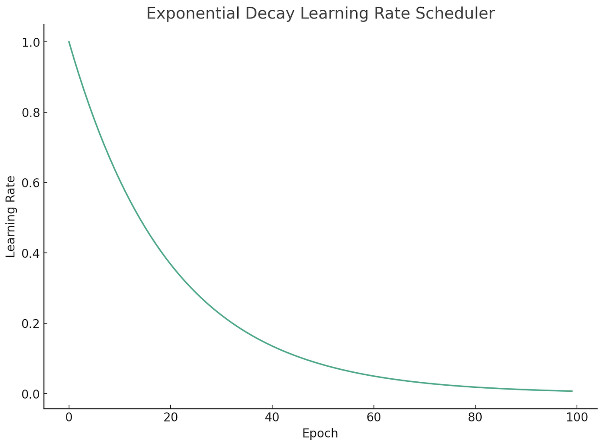
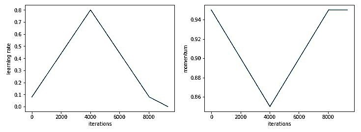

# scheduled learning rates

Scheduling your learning rate can prove to be beneficial in a variety of forms, it can potentially let your model converge on a global minima with more precision, help your model avoid local minima and escape saddle points, and provide faster training.

Doing so is entirely dependent on other hyperparameters such as bounds of your learning rate, momentum parameter, variance & mean of your inputs, and others.

Scheduling a learning rate is typically done so by ***decaying*** the learning rate to a smaller value as the model continues to train further, to mitigate oscillations as the model begins to converge onto a global optima of the loss space.

Due to the nature of mini-batch gradient descent, which has more frequent weight updates per epoch, larger magnitudes of oscillations in the search space of the loss function might be present, which can be useful in the earlier stages of training a model, but in the latter stages when the model is beginning to converge on an optima, these oscillations can make way for falliblity in the model predictions.

Also, especially when using vanilla gradient descent, without a modified optimizer with momentum, RMSprop, Adam and it's variants, weight updates might continue to oscillate further making it difficult for a model to reach it's optima.

***Decaying*** the learning rate, allows for a model to take smaller, careful, yet more precise steps as it begins to converge on the optimum set of parameters to minimize the loss.

### halving

Halving, is a pretty simple and straightforward means to adjust the learning rate at a given iteration or epoch.

Halving is implemented by a simple division or multplication by $.5$, after a predefined number of epochs, accuracy value, or loss value is reached

```
def gradient_descent(x, y, ... epochs)
    for epoch in range(epochs)
        '''
        Include forward, backward, & weight update.
        '''

        if epoch > 400:
            alpha *= .5
```

It's pretty straightforward and simple but when implemented at the right time, typically when the model begins to near the point where it needs precision to reach the global minima, it can significantly improve the optimization process and increase training effectiveness.

Of course, the 'halving' isn't limited to halving the learning rate, you can also adjust the learning rate over time, by a smaller fraction, though it's entirely dependent on what can help a model train better.

### exponential decay

> *Code for a Neural Network with an Exponentially Decaying Learning Rate, [here](ExLRNN.py)*

Scheduling a learning rate based on exponential decay depends on a hyperparamter, $k$, which is known as the decay rate and the current time step, $t$, which is the total number of weight updates / iterations a model has gone over thus far.

<div align = 'center'>

$\alpha = \alpha * e^{-kt}$

</div>

The higher $k$ is, the faster the learning rate decreases over $t$.

This equation them smoothly, exponetially decays the learning rate, $\alpha$, as the number of iterations, $t$ increases over time.

<div align = 'center'>
</img><br>
<span style = 'font-size: 12px'> An exponentially decaying learning rate </span>
</div>

## cyclical learning rates, 1cycle policy, & superconvergence

> *[Code for a Neural Network with Cyclic Learning Rate](CyclicNN.py)*
> 
> *Leslie Smith's paper, [Cyclical Learning Rates for Training Neural Networks](https://arxiv.org/pdf/1506.01186)*

A cyclical learning rate is a learning rate schedule that involves carying the learning rate between a range of minimum or maximum bounds.

These minimum and maximum bounds are typically found through conjectures of what the optimum learning rate could be, and then empirical testing over time, which involves the *learning rate rate range test*.

### cyclical learning & the lr range test

Now, a common type of cyclical learning rate policy is known as the *triangular learning rate policy* where the learning rate varies cyclically on a triangular path, meaning linearly increasing to the maximum bound and then linearly decreasing to the minimum bound over a set number of epochs, which is known as the cycle size.

<div align = 'center'>
 </img><br>
<em> Credit goes to Leslie Smith.</em>
</div><br>

This triangular learning rate policy, can be used to perform the *learning rate range test*, where one sets a high, optimistic value for the learning rate as as an initial maximum bounds for the learning rate, and a minimum bounds, defining the lowest value one would want the learning rate to be.

These two bounds serve as initial hypothesis of what the optimal range for the cyclic learning rate could be.

The learning rate, is found by running your model over a shorter range of epochs, letting the model train as the learning rate linearly oscilaltes over a single full cycle, meaning the learning rate has oscillated from the minimum $\rightarrow$ maximum $\rightarrow$ minimum, at least once.

Once you visualize the results, you find the value of the learning rate, $\alpha$, at which the accuracy began to decrease and the loss of the model began to increase, rather than the opposite. It's at this value, which you've found the maximum bound for your learning rate and set the $\alpha_{max}$ a factor smaller than that maximum bounds, say $.8$ or $.9$.

The formula for implementing a cyclical learning rate, with the triangular policy can be defined as:

<div align = 'center'>

$cycle = floor(1 + \frac{iter}{2(step_{size})})$

$x =|\frac{iter}{step_{size}} - 2(cycle) + 1|$

$\alpha = \alpha_{min} + (\alpha_{max} - \alpha_{min}) * max(0, 1 - x)$

</div>

Where $iter$ is defined as the total iterations / weight updates that a model has gone through, $step_{size}$ is the amount of iterations it takes to get to the set maximum bounds of the learning rate, $cycle$ denotes the amount of times a model has gone through a full cycle (from min $\rightarrow$ max $\rightarrow$ min)  

These equations implemented prior to the weight update, calculating a final $\alpha$ to then use in the update rule, $\theta = \theta - \alpha * \frac{∂L}{∂\theta}$.

By implementing the above equations, you can implement the aforementioned learning rate test, to then find the optimum learning rate bounds, for cycling the learning rate.

It's important to note, when you're implementing a cyclical learning rate, with a momentum term, $\beta$, you'd look to decrease $\beta$ and $\alpha$ increases.

This is done so in order to allow for a large maximum bounds of $\alpha$, whilst still retaining training stability. The learning rate is one of the most improtant hyperparameters to tune, ensuring it's bounds can become wider while implementing a cyclical learning rate is of higher importance than maintaining a higher momentum value.


> [!NOTE]
> *If you're curious, check out an implementation of a cyclical learning rate, [here](CyclicNN.py).*

### superconvergence

> *Original paper by Leslie, "Super-Convergence: Very Fast Training of Neural Networks Using Large Learning Rates", [here](https://arxiv.org/pdf/1708.07120)*

Superconvergence, another idea presented by Leslie Smith, is essentially a method where we can train a neural network orders of magnitude faster than traditional methods, due to the use of a cyclical learning rate and a 1cycle learning rate policy.

With this method, the learning rate, $\alpha$ begins at a very small value and then is increased linearly, following the triangular policy, to find the maximum bounds, $\alpha_{max}$, using the learning rate range test.

Then, the minimum bound for $\alpha$ is found by dividing $\alpha_{max}$ by an order of $3$ or $4$. 

The learning rate is then cycled for only a single full cycle, once that full cycle is complete, then $\alpha$ is decreased once more, a couple of orders of magnitude, to below $\alpha_{min}$.

This is called the 1cycle policy which, was found to bring faster training with higher accurcy in specific scenarios.

<br>
<div align = 'center'>
</img>
</div>
<br>
The intuition behind this is, beginning with a smaller learning rate allows for a model to find it's way through the search space of the loss surface, then once the model is well on it's way through the intermediate stages of training, it could make use of a higher learning rate to escape saddle points and effectively navigate through them at a faster rate, then whilst it begins to near the final stages of training, a smaller learning rate is needed to allow for the model to find the global optima of the loss surface with more precision.
<br><br>
It's at the latter stages, where precision becomes extremely important otherwise the model risks overshooting, which is why a smaller learning rate can be extremely important.
<br><br>
Then superconvergence, can be an extremely powerful tool for speeding up the trianing of a model during the middle stages of training, while allowing for the model to still converge on it's set of parameters for the global optima of the loss surface.

