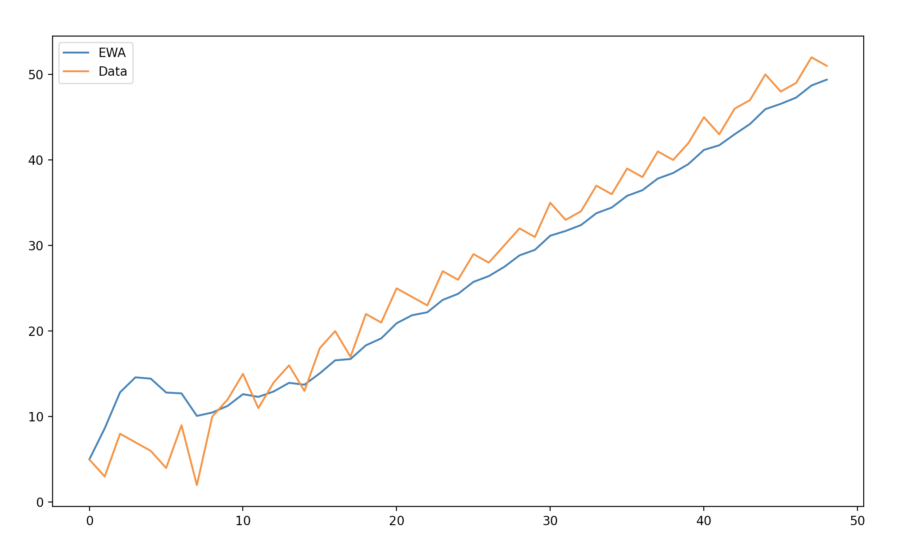

## optimization

In addition to traditional gradient descent, which involves:

$Z1 = forward(W1, X, B1)$

$A1 = ReLU(Z1)$

$Z2 = forward(W1, X, B2)$

$A2 = Softmax(Z2)$

$∂W1, ∂B1, ∂W2, ∂B2 = Backward(X, Y_{onthot}, W2, A2, A1, Z1)$

$W1, B1, W2, B2 = Update(W1, B1, W2, B2, ∂W1, ∂B1, ∂W2, ∂B2, \alpha)$

There are other means, better algoithms, that can be implemented to modify the traditional gradient descent, and make way for faster training and convergence of a neural network.

> [!NOTE]
> *Of course, at least when used right.*

Some of these improved optimizers, include momentum, RMSprop, Adam, and AdaMax, all involving a foundational concept called [Exponentially Weighted Averages](https://en.wikipedia.org/wiki/Exponential_smoothing).

### exponentially weighted averages

> [EWA Sample Code](EWA.py)

Exponentially weighted averages (EWA), or known as exponential moving averages, are a means to average and smooth out a set of data points over time $t$, based on a smoothing parameter, $\beta$.

The difference between an EWA and a simple moving average (SMA), lies in the fact that the EWA puts more weight on the more recent data points, while the SMA puts equal weight on all data points through a period of time. 

Therefore, if a set of datapoints appear to be in an upward trend, the EWA at time $t$, will be at a greater value than the SMA, as the SMA, doesn't consider the recent upward trend to be more important than previous datapoints.

Inversely, the EWA at a time $t$, when a set of datapoints is in a downward trend,will be at a lower value when compared to a SMA, as the SMA doesn't consider the downward trend to be of higher importance in comparison to past data points. For the SMA, everything is equivalent

</img>
<em style = 'font-size:12px'> Notice the difference, between the EWA and SMA</em>

 

When comparing the EWA to a traditional weighted moving average (WMA), the difference lies in how the weights of both decay. The EWA decays it's weights over $t$ exponentially while the WMA decays it's weights over $t$ linearly.

> *This doesn't neccesarily mean that the smoothing of an EWA will be steeper than the WMA, due to the exponentially decaying nature of it's weights, that's all dependent on the smoothing parameter, β*.

The equation for computing an EWA is defined as:

$V\theta = \beta * V\theta_{t-1} + (1 - \beta) * \theta_t$

where $\beta$ is the smoothing parameter, $V\theta_{t-1}$ is the exponentially avereaged data point at the previous time step $t$, and $∂\theta_t$ is the derivative of the current data point at time $t$.

Now, while that's the meat of the formula for computing an exponentially weighted average, initially when doing so, there can be a type of bias that inhibits the EWA from truly averaging a set of datapoints at the beginning.

This is as the EWA is initially biased towards $0$ as in the above formula for $V\theta$, the initial input of $V\theta_{t-1}$, is at a value of 0 due to a lack of previous time steps, $t$.

</img>

An EWA with a bias would end up looking like the green line above, while an EWA without a bias would look like the red line.

To ensure the calculation of an EWA without a bias, we can then divide the output, $V\theta_t$, by a bias correction term which is defined as $1 - \beta^t$.

Then, the full equation becomes:

$V\theta_t = \frac{\beta * V\theta_{t-1} + (1 - \beta) * V}{1 - \beta^t}$

Now, the $\beta$ parameter determines how smooth the final output of averaging youdataset will be.

The higher a $\beta$ is, the more smoothed out your dataset will be when applying EWAs, while with the inverse, when your $\beta$ is a smaller value, the more aligned the final output of the EWA will be with your original dataset.

As an example, say I had a dataset of 50 samples, and to begin, I applied an EWA with a $\beta$ value of .7. 

The results, would look something like this:

</img> 
<em style = 'font-size:12px'> Where the orange line is the original data and the blue line is the exponentially weighted averaged data.</em>

 

Where it's clear that the exponentially averaged data points are more smoothed out than the original jagged dataset.

Say I apply a $\beta$ parameter with a value of $.3$, the difference would look like this:

</img> 

Here, the averaged dataset is more in line to the original data, with little modification to it.

Now, if I had a  $\beta$ value of 0:

 </img> 

Here, the averaged datapoints seems to be non-existent, as it's completely in line with the original dataset, meaning a $\beta$ of 0 has no effect.

Ultimately, EWAs are just a means of averaging a dataset overtime $t$,  in a manner that puts less weight on earlier data points than more recent data points in an exponentialy decaying manner.

### gradient descent with momentum

> *[Implementation of a Neural Network with momentum based gradient descent.](MomentumNN.py)*

Momentum based gradient descent, is a means to increase the speed of convergence of a neural network by adding a *momentum* which is able to give the model a slight "push" in the right direction towards the global optima.

The problem posed in the traditional gradient descent algorithm, was that it enables varying degrees of vertical oscillations in the learning path, ultimately decreasing the speed of convergence as a model isn't as intentional towards finding the local optima.

The cause of this being that the gradients of the loss with respect to a parameter can wildly vary and may not be smoothed throughout the process of training a model. 

</img> 
<em style = 'font-size:12px'> For example, a learning path of gradient descent without momentum. </em>

 

While one could increase the learning rate, $\alpha$, it might be likely that an increased $\alpha$ would purely continue to increase the magnitude of the oscillations rather than set the learning path on a more direct and horizontal journey to the global optima.

While decreasing $\alpha$ might smooth out these oscillations, the consequence of doing so is a decreased step size and overall slower learning which can be negatively consequential for making the most out of a training run in a shorter period of compute time.

The ideal scenario would be to smooth these vertical oscillations, while retaining the value of $\alpha$, to optimize for faster and more direct learning to reach the global optima.

Essentially, this is what an exponentially weighted average (EWA) can make way for, by computing the averaged data points up until time point $t$.

If you recall how EWA smoothes data points, 

</img>

the same process can be applied to the gradients of the loss with respect to a paramter, $\theta$, to smooth them out by averaging, allowing for less vertical oscillations within them, and then less vertical oscillations in the overall learning curve.

Ultimately then, when applied, the learning curve would end up being smoother, allowing for faster learning, while retaining a similar magnitude of $\alpha$.

</img>

> [!NOTE]
> *Notice how momentum based gradient descent is more intentional and is able to take larger step sizes when compared to vanilla gradient descent*

So, momentum with gradient descent, can be applied in a similar way to EWAs, we now average the gradients up to a current iteration step, $t$, and then use the average gradient within the weight update.

$∂W_1, ∂B_1, ∂W_2, ∂B_2 = backward(X, Y_{onehot}, W_2, A_2, A_1, Z_1)$

$V∂W_1 = \frac{\beta * V∂W_{1t-1} + (1 - \beta) * ∂W_1}{1 - \beta^2}$

$V∂B_1 = \frac{\beta * V∂B_{1t-1} + (1 - \beta) * ∂B_1}{1 - \beta^2}$

$V∂W_2 = \frac{\beta * V∂W_{2t-1} + (1 - \beta) * ∂W_2}{1 - \beta^2}$

$V∂B_2 = \frac{\beta * V∂B_{2t-1} + (1 - \beta) * ∂B_2}{1 - \beta^2}$

$W_1, B_1, W_2, B_2 = update(W_1, B_1, W_2, B_2, ∂VW_1, ∂VB_1, ∂VW_2, ∂VB_2, \alpha)$

Note, that in this case, we don't need to apply a smoothing value if note desired, in practice it can be ignored, with the consequence being that it might take a couple of iterations or epochs, depending on the depth of your neural network, for the averaged gradients to *"warm-up"* and represent a true moving average.

So then if desired, we can just define the averaged gradients for a parameter $\theta$, as:

$V∂\theta = \beta * (V∂\theta_{t - 1}) + ( 1 - \beta ) * ∂\theta$

without a smoothing term.

>[!NOTE]
> *If you're curious, check out an implementation [here](MomentumNN.py)*

### RMSprop

> *[Implementation of a Neural Network with RMSpropagation](RMSpropNN.py)*

Another algorithm, as a modified alternative gradient descent is Root Mean Squared Propagation or RMSprop for short.

RMSprop involves the decay of the learning rate, $\alpha$, as the gradients of the loss with respect to a parameter $\theta$, increase. 

Inversely, as a gradient, $\frac{∂L}{∂\theta}$, begins to decrease, the learning rate begins to increase.

Unlike traditional scheduling of $\alpha$, $\alpha$ is instead scaled over time $t$ by dividing $\alpha$ over the root mean squared (RMS) of the exponentially weighted averaged (EWA) gradients squared, $S∂\theta$.

So the equation to caluclate the EWA of $\theta^2$ is defined as:

 

$S∂\theta = \beta * S∂\theta_{t-1} + (1 - \beta) * ∂\theta^2$

Unlike previously, as done in momentum, when computing the exponentially weighted averages of the gradients, RMSprop typically doesn't incorporate bias correction in practice, as it's absence doesn't affect the algorithm as heavily, but in cases where the bias does inhibit learning, the bias correction value may be needed.

$S∂\theta = \frac{S∂\theta}{1 - beta^t}$ 
<em style = 'font-size: 12px'> Which then, the bias correction woudl be applied like this. </em>

Thereafter, once $S∂\theta$ is calculated, you adaptively scale the learning rate, within the update rule ($\theta = \theta - \alpha * \frac{∂L}{∂\theta}$) through a division by the RMS of $S∂\theta$.

$\theta = \theta - \frac{\alpha}{\sqrt{S∂\theta^2 + \epsilon}} * \frac{∂L}{∂\theta}$ 
<em style = 'font-size:12px'> Note the addition of a small epsilon to avoid division by 0. It's typically on the order of 1e-6 or smaller.</em>

Keep in mind that the exponentially averaged gradients, squared, is a fluctuating term over time. Increasing as the raw gradients increase, and decreasing as the raw gradients decrease.

Therefore, as $∂\theta$ increases, $S∂\theta$ will increase, then $\sqrt{S∂\theta^2}$ will increase, therefore the division of $\alpha$ over $\sqrt{S∂\theta^2}$ will result in a smaller alpha as $∂\theta$ increases and inversely as $∂\theta$ decreases. 

It's also important to note that RMSprop is more sensitive to the magnitude of a learning rate. While typically you might've been able to set a learning rate to $.1$ for instance, you'd need to scale you learning rate down to say $.01$ or $.001$ to make sure you don't introduce unwanted instability to your model.

So ultimately, if we put this all together for a model with parameters $W_1$, $B_1$, $W_2$, and $B_2$, it'd look as:

$∂W_1, ∂B_1, ∂W_2, ∂B_2 = backward(X, Y_{onehot}, W_2, A_2, A_1, Z_1)$

$S∂W_1 = \beta * S∂W_{1t-1} + (1 - \beta) * ∂W_1^2$

$S∂B_1 = \beta * S∂B_{1t-1} + (1 - \beta) * ∂B_1^2$

$S∂W_2 = \beta * S∂W_{2t-1} + (1 - \beta) * ∂W_2^2$

$S∂B_2 = \beta * S∂B_{2t-1} + (1 - \beta) * ∂B_2^2$

$W_1, B_1, W_2, B_2 = update(W_1, B_1, W_2, B_2, ∂W_1, ∂B_1, ∂W_2, ∂B_2, S∂W_1, S∂B_1, S∂W_2, S∂B_2, \alpha)$

Similar to momentum, this may reduce the vertical oscillations in the learning path, but at the trade-off of having a smaller learning rate.

While in some situations, this can be beneficial as you'd want a smaller learning rate, if used improperly by tuning to the wrong $\beta$ value, a the adaptive learning rate may end up slowing you down.

It's also important to note, RMSprop doesn't smooth your gradients like a momentum term does, it only adaptively scales the learning rate. 

Therefore, your gradients might still be oscillating wildly in the vertical direction, but their impact onto the learning path would be mitigated by the smaller learning rate when the magnitude of their oscillations is larger.

Then in some cases, it might be beneficial to implement a combination of both, RMSprop and Momentum based gradient descent.

>[!NOTE]
> *If you're curious, check out an implementation [here](RMSpropNN.py)*

### adaptive moment estimation

