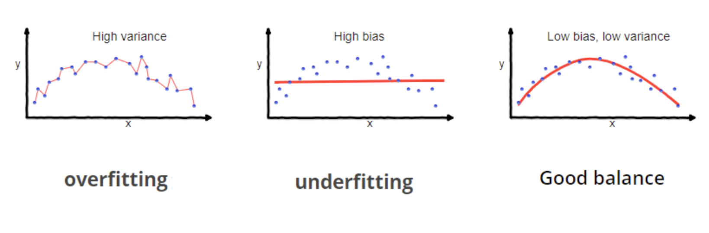
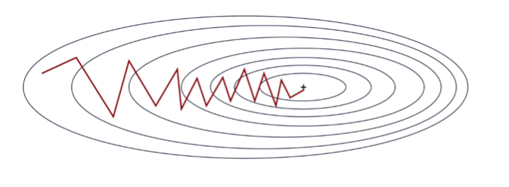
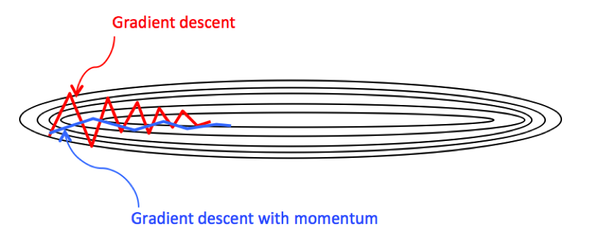

# awesome-neural-networks

> *Last Update: June 26, 2024*

This repository is a dive into vanilla neural networks, implemented in pure NumPy to accelerate foundational learning.

It's designed for anyone with a base level of knowledge on Calculus, Linear Algebra, and Programming to gain an understanding of Neural Networks from the first principles.

## table of contents

- [awesome-neural-networks](#awesome-neural-networks)
  - [table of contents](#table-of-contents)
  - [motivation](#motivation)
- [logistic \& softmax regression](#logistic--softmax-regression)
  - [into logistic regression](#into-logistic-regression)
    - [Touching on the logistic sigmoid function](#touching-on-the-logistic-sigmoid-function)
    - [the forward pass](#the-forward-pass)
    - [the artifical neuron](#the-artifical-neuron)
    - [computing the loss](#computing-the-loss)
    - [the backpropagation](#the-backpropagation)
    - [weight updates](#weight-updates)
    - [gradient descent](#gradient-descent)
  - [into softmax regression](#into-softmax-regression)
    - [modifying the loss function](#modifying-the-loss-function)
- [into neural nets](#into-neural-nets)
    - [the architecture](#the-architecture)
    - [the forward pass](#the-forward-pass-1)
    - [the backpropagation](#the-backpropagation-1)
    - [weight update](#weight-update)
    - [gradient descent](#gradient-descent-1)
    - [mini-batch gradient descent](#mini-batch-gradient-descent)
  - [parameter initialization](#parameter-initialization)
    - [xavier initialization](#xavier-initialization)
    - [kaiming initialization](#kaiming-initialization)
- [activation functions](#activation-functions)
    - [σ](#σ)
    - [Softmax](#softmax)
    - [TanH](#tanh)
    - [ReLU](#relu)
    - [Leaky ReLU](#leaky-relu)
- [Regularization](#regularization)
- [L1 \& L2 Regularization](#l1--l2-regularization)
    - [L1 Regularization](#l1-regularization)
    - [L2 Regularization](#l2-regularization)
  - [Dropout](#dropout)
- [scheduled learning rates](#scheduled-learning-rates)
    - [halving](#halving)
    - [exponential decay](#exponential-decay)
    - [cyclical learning rates, 1cycle policy, \& superconvergence](#cyclical-learning-rates-1cycle-policy--superconvergence)
    - [cyclical learning \& the lr range test](#cyclical-learning--the-lr-range-test)
    - [superconvergence](#superconvergence)
- [optimization](#optimization)
    - [exponentially weighted averages](#exponentially-weighted-averages)
    - [gradient descent with momentum](#gradient-descent-with-momentum)
    - [RMSprop](#rmsprop)
    - [adaptive moment estimation](#adaptive-moment-estimation)
    - [adamax](#adamax)
    - [nesterov momentum](#nesterov-momentum)
  - [normalization](#normalization)
    - [normalizing first-layer inputs](#normalizing-first-layer-inputs)
    - [Batch Normalization](#batch-normalization)


## motivation

Neural Networks, in the context of artifiical intelligence, have been powering LLMs ([GPT-4o](https://openai.com/index/hello-gpt-4o/), [Claude-3](https://www.anthropic.com/news/claude-3-family), [Gemini](https://deepmind.google/technologies/gemini/), [Mixtral](https://mistral.ai/news/mixtral-of-experts/), etc) and leading the charge towards progressing to a hypothetical artifical general intelligence. 

The possible futures humanity can unlock with these models are increasingly optimistic and they prove to be an invaluable tool, for those who are inspired to accelerate the coming of artifical intelligence, to learn from first principles.

Personally, I knew that if I wanted to get deeper into the technical trenches of convolutional neural networks, transformers, deep RL, and more, foundational knowledge was key to understand and refine.

So this is why I built this repo, to build foundational knowledge for myself and build a resource for others to do so as well.

# logistic & softmax regression

> *[Logistic Regression Code](logistic.py) | [Softmax Regression Code](softmax.py)*

If you're familiar with [linear regression](https://www.youtube.com/watch?v=7ArmBVF2dCs), a model where you aim to construct a line of best fit to a set of linear data points ($\vec{X}$) through the equation, $Y = WX + B$, and by iteratively adjusting the model parameters ($\vec{W}$ and $\vec{B}$), it's important to **not**, I repeat, **not,** get logistic or softmax regression confused with fitting a line of to a set of datapoints.


<p align="center">
  <br>
  <span style="font-size:12px;">In essence, this is what linear regression aims to do.</span>
</p>


Logistic regression by itself, is not at all akin to linear regression in terms of outcome.

Rather, for intuition, in [logistic regression](https://www.youtube.com/playlist?list=PLblh5JKOoLUKxzEP5HA2d-Li7IJkHfXSe), the outcome of a model isn't exactly to construct a line of best fit to a set of datapoints but rather to perform [binary classification](https://en.wikipedia.org/wiki/Binary_classification) on a given set of datapoints.

## into logistic regression

In essence, logistic regression involves a combination of an affine transformation and the [`logistic`](https://en.wikipedia.org/wiki/Logistic_function) activation function, which is commonly called *sigmoid* and referenced as $\sigma()$, to perform [binary classification](https://en.wikipedia.org/wiki/Binary_classification).

### Touching on the logistic sigmoid function

The `logistic sigmoid` activation function can be mathematically defined as:

<div align = 'center'>

$\sigma(x) = \frac{1}{1 + e^{-x}}$
</div>

It's shape takes on a continuous and smooth s-shaped curve, bounded at it's range between $[0, 1]$ and in it's domain, $[-\infty, \infty]$.

<p align = 'center'>
    <br>
    <span style = "font-size:12px">The s-shaped logistic curve</span>
</p>

Within this function, as the denominator grows ever-large, it's final output diminishes to near $0$ while inversely, as the denominator becomes increasingly small, the output converges to a near perfect $1$.

As an example of a near $0$ output, let's take an input $x$ that's extremely negative (at least "extreme" in terms of $\sigma$), for example $-20$:

<div align = 'center'>

$\sigma(-20) = \frac{1}{1 + e^{- (-20)}}$

$\sigma(-20) = \frac{1}{1 + e^{20}}$

$\sigma(-20) = \frac{1}{1 + 485165195.40978}$

$\sigma(-20) = \frac{1}{485165196.40978}$

$\sigma(-20) = 2.06115362\times10^{-9} \approx .00000000206115$

</div>

As you can see, large negative values can lead to a near vanishing output of $\sigma$.

Now for an example of an output that's near $1$, we can take an input $x$ that's positively large, for example, $20$:

<div align = 'center'>

$\sigma(20) = \frac{1}{1 + e^{- (20)}}$ 

$\sigma(20) = \frac{1}{1 + e^{20}}$

$\sigma(20) = \frac{1}{1 + 2.718281828459^{-20}}$

$\sigma(20) = \frac{1}{1.0000000020612}$ 

$\sigma(20) = .99999999793$ 

</div>

And if we want to reach the intermediary value, $.5$, we can define the input as $0$:

<div align = 'center'>

$\sigma(0) = \frac{1}{1 + e^{- (0)}}$

$\sigma(0) = \frac{1}{1 + 1}$

$\sigma(0) = \frac{1}{2} = .5$
</div>

Pretty simple.

Now the gradient of the `logistic sigmoid` function follow a bell shaped curve, akin to the shape of a gaussian distribution:


<div align = 'center'>

</div>


You can notice, as the inputs ($x$-axis) tend to increase towards large postive or negative values, the gradient begins to *vanish*. This *vanishing* is called a *vanishing gradient* which can pose a problem to a model that makes use of this logistic sigmoid activtion function

>*This will be covered more later.*

So, this logistic sigmoid function makes up only $1$ portion of the logistic regression, it being the latter computation for it to produce a meaningful output.

The former computation is what's known as an *affine transformation*, which as mentioned earlier, is just a simple $Z = WX + B$

> *If you recall from middle / high school algebra...*

This affine transformation is made of 3 variables, where:

<div align = 'center'>

$X:=$ ***The Input Features***

$W:=$ ***The Weight Parameter(s)***

$B:=$ ***The Bias Parameter(s)***

</div>

and $Z$ is commonly known as the weighted sum, which we then feed into the $\sigma$ function, for a final output.

### the forward pass

One entire computation through the affine transformation and logistic sigmoid activation is what is known as a ***forward pass.***

Putting this all together, we can dumb down our entire mathematical flow to this.

<div align = 'center'>

$Z = WX + B$

$\hat{Y} = A = \sigma(Z) = \frac{1}{1 + e^{-Z}}$

</div>

*Where our activation, $A$, can be defined by $\hat{Y}$, denoting the prediction the logistic regression makes after a forward pass.*

It's important to note that the multiplication of $W$ and $X$ is the matrix multiplication of each, not an element wise multiplication, at least when $W$ and $X$ are vectorized.

It's also important to know the role of the activation function in a such a model. $\sigma$ is a non-linear function, meaning it's inputs don't correlate to it's outputs. 

Therefore, you aren't bounded to building a **simple linear classifier** that's unable to learn complex features. The introduction of the non-linear activation function allows for a model to learn non-linear features.

Now, at this point, it's useful to introduce the **artificial neuron**.

> *Although, calling it **neuron** can prove to be misleading as it's computation doesn't really resemble the compelxity of a real **neuron***

### the artifical neuron

An artifiical neuron, sometimes referred to as a [perceptron](https://en.wikipedia.org/wiki/Perceptron), serves a a means of packing the above computation into a single describable model.

It's name stems from it's high-level resemblance to a biological neuron, where it's composed of:

1. An Input
2. An Activation
3. A final output

But on a lower level, a real biological neuron is increasingly more complex than an artifiical "neuron", involving neurotransmitters, ion channels, and much more to output continuous signals, not discrete values.

<p align = 'center'>
   <br>
  <span style = "font-size:11px"> A biological neuron vs an artificial neuron</span>
</p>

This model of a single neuron can be used to represent the computation of the logistic regression, as:

<p align = 'center'>
   <br>
  <span style = "font-size:11px"> </span>
</p>

Here, the inputs $X_i$ flow into the individual neuron, where then the affine transformation, $WX + B$ is computed, to then be fed into the $\sigma$ function, then finally outputting $y$ or in our case, will be denoted as $\hat{Y}$.

One pass through this computation can be known as a ***forward pass***.

One last thing to note, is that when computing the final result of this logistic regression model, the $\sigma$ function will provide a value within the range $[0, 1]$. 

To get a final result for binary classification, which is what a logistic regression is designed to compute, you can take the output and apply a thresholding operation where,

```math
pred = \begin{cases} 1, p > .5 \\ 0, p < .5 \end{cases}
```

If your labels are originally defined as words, say **cat** and **dog**, you'd typically want to encode the words to be mapped to the numbers $0$ and $1$, so you can accurately compute the **accuracy** and **loss** (the amount of error).

This effectively allows us to classify the predictions of the model to one of the available binary classes.

### computing the loss

The ***loss*** of a logistic regression model is essentially the amount of *error* that the model had during a given forward pass of data.

The loss function plays an invaluable role in our model, as it essentially defines the surface of the search space for our model, to look for the optimal paramters $W$ and $B$ during gradient descent, which we'll cover soon.

<div align = 'center'>

<br>
<em> The surface of a loss function, simplified</em>
</div>

For intuition, the loss function we defined above can define a loss surface as presented in the image above. 

>*Though typically, the more parameters that are introduced into a model, the more complex dimensionality a loss surface has. The above is a simplification of what a loss surface might look like, as it's difficult for us humans to visualize shapes that are Nth-dimensional, above **3D***.

A model will aim to minimize the value of the loss function, to reach a global optima of the given surface, which in the image above, can be represented by the deep blue region.

It's at this deep blue region, where a model would have learnt the optimal parameters for making accurate predictions.


While in linear regression, you might've seen the loss to be computing using the mean absolute error or mean square error functions, in logistic regression we can compute the loss by using what's known as the ***binary cross entropy loss function.***

This function takes in $Y$, which is the true label for a given input feature and $\hat{Y}$, which is the model's output, aiming to predict $Y$.

<div align = 'center'>

$L(Y, \hat{Y}) = - Y \cdot ln(\hat{Y}) - (1-Y) \cdot ln(1-\hat{Y})$
</div>

Within this function, if our label $Y$ is denoted as $0$, we effectively cancel out the first portion, $-Y \cdot ln(\hat{Y})$ due to a multiplication of $ln(\hat{Y})$ by $0$. 

Therefore, we'd only compute: $- (1 - Y) \cdot ln(1 - \hat{Y})$.

Now for example if our $\hat{Y}$ turnt out to be the value $.24$, our loss would be computed as:

<div align = 'center'>

$L(0, .24) = - (1 - 0) \cdot ln(1 - .24)$

$L(0, .24) = -1 \cdot ln(.76)$

$L(0, .24) = -1 \cdot -0.2744368457017603$

$L(0, .24) = 0.2744368457017603$

</div>

On the flip side, if our label $Y$ was denoted as $1$, we can cancel out the second portion of the equation, $(1 - Y) \cdot ln(1 - \hat{Y})$, as $(1-Y)$ would bring a multiplication of $0$ with $ln(1 - \hat{Y})$

So now, if our predicted class label, $\hat{Y}$, was $.82$, our loss would be computed as:


<div align = 'center'>

$L(1, .82) = - 1 \cdot ln(.82)$

$L(1, .82) = 0.19845093872383832$
</div>

If you're curious to get a look into a code implementation, in `numpy`, this loss function can be simply defined as:

```
Loss = -Y * np.log(Y_hat) - (1 - Y) * np.log(1 - Y_hat)
```

### the backpropagation

The backward pass, also known as backpropagation, of the model is an essential prerequisite to compute, in order to then allow for a logistic regression model to learn or train by continuously adapting it's weights to minimize the value of the loss function.

Backpropagation involves the caluculation of gradients (aka derivatives) of the given loss function with respect to a set of parameters, $\theta$, which in our case, will be $W$ or $B$.

These gradients play an essential role, as they essentially denote the level of "steepness" at a point on the surface of the loss, that a given set of parameters put the model on.

<br>
<div align = 'center'>

</div>
<br>

In this image, the red-most regions are the most "steep", while the deep blue regions are more flat. Thereby, the red regions will have a higher gradient than the deep blue region, ultimately increasing the magnitude of the weight update.

> *The weight update and it's magnitude will be more intuitive once we get to the update rule*.

By noting this "steepness", the gradients tell us the direction the parameters should be updated to and the magniude of the update, which is proportional to the steepness of the loss.

Now, calculating the gradients of the loss function with respect to set of parameters is done through the chain rule.

> *This is where high school calculus comes in handy*

To compute the gradients for $W$ or $B$ (I'll use $\theta$ to represent either), we have to dig all the way back by computing the gradients of earlier variables prior.

The entire calculation will look as:

<div align = 'center'>

$\frac{∂L(Y, \hat{Y})}{∂\theta} = (\frac{∂L(Y, \hat{Y})}{∂\hat{Y}})(\frac{∂\hat{Y}}{∂Z})(\frac{∂Z}{∂\theta})$

</div>

So to find the gradients of the loss with respect to $W$ and $B$, we'd first need to compute the gradients with respect to the outermost variables, which in our case is $\hat{Y}$ and $Z$.

So in the case of logistic regression, where we use the binary cross entropy loss, $L(Y, \hat{Y}) = - Y \cdot ln(\hat{Y}) - (1-Y) \cdot ln(1-\hat{Y})$, and the $\sigma$ activation function, $\frac{1}{1 + e^{-z}}$, we'd take the gradient of $L(Y, \hat{Y})$ with respect to $Z$ to get our first gradient.

**We'll refer to the gradient $\frac{∂L(Y, \hat{Y})}{∂Z}$, as $∂Z$ and $\frac{∂L(Y, \hat{Y})}{∂Z}$ as $∂\hat{Y}$  to make things clear.**

This calculation of $∂Z$ implicitly computes $∂\hat{Y}$, so we can avoid the stand along calculation of $∂\hat{Y}$.

<div align = 'center'>

$∂Z = \frac{∂L(Y, \hat{Y})}{∂Z} = (\frac{∂L(Y, \hat{Y})}{∂\hat{Y}})(\frac{∂\hat{Y}}{∂Z}) = \hat{Y} - Y$
</div>

> *To keep things simple, we won't be deriving the full gradient with respect to Z here.*

So referring back to our original equation of the chain rule, 
$\frac{∂L(Y, \hat{Y})}{∂\theta} = (\frac{∂L(Y, \hat{Y})}{∂\hat{Y}})(\frac{∂\hat{Y}}{∂Z})(\frac{∂Z}{∂\theta})$, now that we have $∂Z$, we can use the chain rule to calculate the gradients with respect to $W$ and $B$.

<div align = 'center'>

$∂W = (∂Z)(\frac{∂Z}{∂W}) = (\hat{Y} - Y) \cdot X^T$

$∂B = (∂Z)(\frac{∂Z}{∂B}) = (\hat{Y} - Y) \cdot 1$
</div>


Now, these gradients $∂W$ and $∂B$, will play an important role in the update rule of our model, finalizing one pass of gradient descent.

### weight updates

The gradients that were computed earlier can be used to update the parameters $W$ and $B$, through what's called the update rule.

This update rule is defined as - $\theta = \theta - \alpha \cdot ∂\frac{∂L(Y, \hat{Y})}{\theta}$  - where $\alpha$ is the ***learning rate*** or our model.

The *learning rate* plays an essential role in defining how fast or how slow our model is able to learn over time.

We can't set the learning rate to be too high, or else our model won't be able to effectively converge on a global minima of the loss surface as it'll begin to overshoot past. Inversely, setting the learning rate too low might cause slow and inefficient training.

> *There are many more nuances to setting a learning rate but for now, that's all that matters.*

So, in our case where we have parameters $W$ and $B$, we can define the weight updates as:

<div align = 'center'>

$W = W - \alpha \cdot \frac{∂L(Y, \hat{Y})}{∂W}$

$B = B - \alpha \cdot \frac{∂L(Y, \hat{Y})}{∂B}$

</div>

This weight update allows for the parameters $W$ and $B$ to be updated in such a way that the model begins to minimize the value of loss, optimizing for a global minimum, ultimately increasing it's accuracy as a byproduct.

Let's say we had a fixed value of $\alpha$ at $.1$. If a hypothetical gradient, say $∂W$ was larger, at a value of $2.4$, our weights, $W$ would update by a value of $.24$. 

<div align = 'center'>

$W = W - .1 \cdot 2.4$

$W = W - .24$
</div>

Inversely, if our gradient, $∂W$ was smaller, at a value of $.1$, our weights, $W$, woudl update by a mere $.01$.


<div align = 'center'>

$W = W - .1 \cdot .1$

$W = W - .01$
</div>


So if we sum everything that's been covered up thus far, up until now, we've computed a single pass of *gradient descent*, comprised of a ***forward pass*** and a ***backward pass***.

### gradient descent

Gradient descent is built upon the foundations just covered, the forward pass, the backward pass, and the weight updates.

One iteration of gradient descent is represents one pass through this entire process.

This is typically done for multiple iterations, as much as need be, as the more iterations gone through a pass of gradient descent,  the more 'fit' or trained a model will typically be to a dataset.

So to put this all together, one pass of gradient descent for `logistic regression` can be mathematically defined (with some pseudocode) as:

> [!IMPORTANT]
>*Where one epoch is a single pass through your entire dataset.*

<div align = 'center'>

$for \:\: epoch \:\: in \:\: range(epochs):$

$Z = WX + B$

$\hat{Y} = A = \sigma(Z) = \frac{1}{1 + e^{-Z}}$

$Loss = - Y \cdot ln(\hat{Y}) - (1-Y) \cdot ln(1-\hat{Y})$


$∂Z = (\frac{∂L(Y, \hat{Y})}{∂\hat{Y}})(\frac{∂\hat{Y}}{∂Z}) = \hat{Y} - Y$
3
$∂W = (∂Z)(\frac{∂Z}{∂W}) = (\hat{Y} - Y) \cdot X^T$

$∂B = (∂Z)(\frac{∂Z}{∂B}) = (\hat{Y} - Y) \cdot 1$

$W = W - \alpha \cdot \frac{∂L(Y, \hat{Y})}{∂W}$

$B = B - \alpha \cdot \frac{∂L(Y, \hat{Y})}{∂B}$

$return \:\: W, B$
</div>

Now, to effectively trian your model, you'll need to run it for a set number of epochs until it converges to your the global optima of the loss for your datset.

**You can check out a coded implementation [here](logistic.py), to see how you might be able to practically build a model out.**

## into softmax regression

> *[Softmax Regression Code](softmax.py)*

Softmax regression is essentially an extension of logistic regression that aims to classify the set of given samples to more than 2 classes, essentially now performing multiclass classification, not binary classification.

This extension is purely brought upon by a modification to the $\sigma$ activation function that generalizes it to computing the probability of multiple classes being the correct label $Y$.

Where you see the $\sigma$ being defined as $\frac{1}{1 + e^{-z}}$, we can now call our new activation function, now called the ***softmax*** activation function, defined as:

<div align = 'center'>

$\tilde{\sigma}(z) = \frac{e^z}{\sum{e^z}}$<br>
</div>


The modification to the $\sigma$ equation, to turn it into ***softmax*** ($\tilde{\sigma}$), allows for the computation of the probabilities for multiple classes.

The calculation of $e^z$ in the numerator, computes the probability for each class within $z$ while the summation of $e^z$ as $\sum{e^z}$, calculates the sums of all probabilities for all classes within $z$.

The division of the $e^z$ by $\sum{e^z}$ allows for the calculation of the normalized logits / probabilities, which our model calculated, that a given sample belongs to a given class indexed by $z$.

Let's say the output logit, $z$, has the dimensions of $(classes, samples)$, where each value along the first axis, $classes$, denotes the unnormalized probability of a sample belonging to a given class.

So in this case, when you take the summation of $e^z$, you'd sum over the first axis as you want to calculate the probabilities over the number of total classes

> *Of course, in practice you might have (samples, classes) instead, in which you'd sum over the second axis instead.*

So ultimately to sum things up, the softmax equation, $\frac{e^z}{\sum e^z}$, allows us to normalize the output logit, $z$, to a probability within the range $[0, 1]$, which can be easily interpretable as a percentage value (%).

In practice, given that the final output is represented in terms of probability, to get a true prediction during inference or testing, you'd want to take the $argmax$ of the output vector, which essentially returns the index of the highest value within the output vector.

For example, say the output, denoted as $\hat{Y}$, was a vector of:

<div align = 'center'>

$[.12, .8, .08]$

</div>

Taking the $argmax$ of the vector, $\hat{Y}$, would return $1$, denoting the index of the class with the highest probability.

If your labels, as an example, $[cat, dog, bear]$, are encoded into integer representations, $[0,1,2]$  the prediction $1$ will be able to represent the $2$nd class of your dataset (given that indices typically begin with $0$).

So the final prediction would be **dog** given that it's the **2nd** class.

### modifying the loss function

We can also modify the loss function to a more simplistic function called ***categorical cross entropy*** which in turn, generalizes the loss calculation to all our classes.

This can be defined as:

<div align = 'center'>

$L(\hat{Y}, Y_{onehot}) = Y_{onehot} \cdot ln(\hat{Y})$

</div>

The difference here is that $Y$, rather than taking the form of raw labels, takes the form of one hot encodings of the labels $Y$. 

Essentially, **a one hot encoding** is a vector of $0$ s and a singular $1$. The index where the singular $1$ is located, identifies our true label.

If I had the one hot encoding of $[0, 0, 0, 1]$, my label would be defined as $3$, as the singular $1$ is located at the 3rd index of the one hot encoding.

If I had the one hot encoding of $[1, 0, 0, 0]$, my label woudl be defined as $0$, as the singular $1$ is located at the 0th index of the one hot encoding.

> *Read more about one hot encodings [here](https://en.wikipedia.org/wiki/One-hot)*

Now, here's a visual for easier understanding of the flow of the softmax regression.

<div align = 'center'>
</img><br>
<em></em>
</div>

<br>

The computation of the softmax isn't too different from the original logistic regression in terms of flow, besides the new activation function, modification to the loss, and introduction of the one hot encoding.

It can be defined as (with of course, the new function, $\tilde{\sigma}$):

<div align = 'center'>

$for \:\: epoch \:\: in \:\: range(epochs):$

$Z = WX + B$

$\hat{Y} = A =\tilde{\sigma}(Z) = \frac{1}{1 + e^{-Z}}$

$Loss = Y_{onehot} \cdot ln(\hat{Y})$

$∂Z = (\frac{∂L(Y, \hat{Y})}{∂\hat{Y}})(\frac{∂\hat{Y}}{∂Z}) = \hat{Y} - Y_{onehot}$

$∂W = (∂Z)(\frac{∂Z}{∂W}) = (\hat{Y} - Y_{onehot}) \cdot X^T$

$∂B = (∂Z)(\frac{∂Z}{∂B}) = (\hat{Y} - Y_{onehot}) \cdot 1$

$W = W - \alpha \cdot \frac{∂L(Y_{onehot}, \hat{Y})}{∂W}$

$B = B - \alpha \cdot \frac{∂L(Y_{onehot}, \hat{Y})}{∂B}$

$return \:\: W, B$
</div>

**To take a dive into it's implementation, check out the code [here](softmax.py)**

# into neural nets

> *[Vanilla Neural Network Code](nn.py) | [Mini-Batch Neural Network Code](MiniBatchNN.py)*

> [!NOTE]
> *The foundations of the [logistic & softmax regression](../01-logistic-&-softmax-regression/README.md) serve as similar foundations for the architectures of neural networks, the difference being that neural networks are **deep** and **complex**.*

### the architecture

Revisiting the model of an artificial neuron:

<div align = 'center'>
</img>
</div>

It can be recalled that a neuron takes in a set of input features, in the image above defined as $f_i$. 

In our case, we'll be defining these inputs as $X_i$, $i$ denoting the index of the feature.

The neuron takes in the set of inputs, $X_i$, applies the affine transformation $WX + B$ and then applies an activation function, either $\frac{1}{1 + e^{-z}}$ (sigmoid) or $\frac{e^{z}}{\sum{e^z}}$ (softmax), depending if you're performing binary classification or multi-class classification, to then output a final value which we'll denote as $\hat{Y}$.

A ***neural network*** has a similar flow in it's forward pass, but just as mentioned earlier, it's a lot more ***deep*** and ***complex***.

What is meant by ***deep*** and ***complex*** is, it contains more ***neurons*** and more ***layers***.

Here's a diagram for reference:

<div align = 'center'>
</img><br><br>
<span style = 'font-size:13px'>Note: Most definitely, <b>not to scale</b></span>
</div>

<br>

Discussing the layers, the left-most layer of this neural network is simply called the ***input layer***. 

This input layer isn't really a layer of the network itself, it's rather a representation of a set of input features to the ***first hidden layer***, where each node is representative of a single input feature.

> [!NOTE]
> *A single input feature, for example, can be a single pixel value of an image*

### the forward pass

Now, every single node / input feature within the input layer is fed into every single neuron individually in the first hidden layer.

> [!NOTE]
> *Typically, the input layer isn't considered as part of the total layer count nor is even called a layer at times. So here, when a "first layer" is mentioned, we'll be referring to the first hidden layer of a neural network, not the input layer*

In prior single neuron examples, an affine transformation was computed to then be fed into an activation function to get a final output.

When we feed an input feature into a neuron in the hidden layer of the network, the same exact process occurs, but per neuron.

In our case though, we'll be replacing the $\sigma$ activation function for a $ReLU$ activation. 

The rationale behind this being that $\sigma$ can prove to be unstable for deep neural networks, given that they're prone to vanishing gradients, and are more expensive to compute given $e$.

> [!NOTE]
> *For the following, it'll be assumed that all inputs, to both the hidden layer and output layer are **vectorized** outputs of a previous layer denoted by a capital variable.*
> 
> *In this case, the inputs are then matrices of dimensions - (n_in, samples) - where n_in are the number of input features to a given layer*.
>
> *To learn more about vectorization, check out this amazing [resource](https://youtu.be/qsIrQi0fzbY).*

<div = align= 'center'>

$z_1^n = w_1^nX + b_1^n$

$a_1^n = ReLU{(z_1^n})$<br><br>
<span style = 'font-size:12px'>The subscript $1$, denoting the first hidden layer.</span>
</div>

Then, the outputs of the hidden layer, $A_1$ in vectorized form for all neurons $n$, are fed into the output layer where the same process, an affine transformation and a non-linear activation, in this case will be softmax ($\tilde{\sigma}$), take place to allow for a final output.

<div align = 'center'>

$z_2^n = w_2^nA_1 + b_2^n$

$\hat{Y} = a_2^n = \tilde{\sigma}(z_2^n)$

</div>

It's important to note, given that we're using the softmax function, the final output is represented in terms of probability.

Just as prior in softmax regression, where we take take the $argmax$ of the final output vector, to get a final class prediction, we can do the same here.

<div align = 'center'>

$pred = argmax(A_2)$

</div>

This value $pred$, given that your labels, $Y$, are encoded into integer representations, can be used to compute an accuracy by averaging the amount of times where $pred = Y$ is true over the number of samples in your dataset

<div align = 'center'>

$accuracy = \frac{\sum{pred == Y}}{samples}$ <br><br>
<span style = 'font-size: 12px'>Pseudo code for computing accuracy, where $\hat{Y} == Y$ would return a boolean value.</span>
</div>

> [!IMPORTANT]
> *When training a neural network, you typically wouldn't use the argmaxed values to computed the loss or to compute gradients to train the model. You'd want to use the raw outputs, A2 as a means to calculate the loss and the gradients as it's more representative of the true outputs of the neural network.*

So now, given the above, we can define a full forward pass of a neural network as:

> [!NOTE]
> ***Note** that from now, all inputs and output values, and paramters will be expressed in [vectorized](https://youtu.be/qsIrQi0fzbY) formats.*

<div align = 'center'>

$Z_1 = W_1X + B_1$ 

$A_1 = ReLU(Z_1)$

$Z_2 = W_2A_1 + B_2$

$A_2 = \tilde{\sigma}(Z_2)$

</div>

Now again, as prior, we can compute the loss using the, ***categorical cross entropy loss function***, just as prior in softmax regression.

<div align = 'center'>

$L(\hat{Y}, Y) = Y_{onehot} * ln(\hat{Y})$<br><br>
<span style = 'font-size: 12px'>Again, where $Y_{onehot}$ are the one-hot encoded labels.</span>
</div>

### the backpropagation

> [!NOTE]
> *We'll be going pretty heavy into calculus and linear algebra here. It's
> important to understand the mathematical foundations, at least that is if you
> truly want to become knowledgeable in deep learning.*
>
>*If you know the first principles, you'll know how to build creatively from them,
> to build novel ideas.*
>
> *Andrej Karparthy put out a more thorough rationale of why you should become a "backprop ninja", read it [here](https://karpathy.medium.com/yes-you-should-understand-backprop-e2f06eab496b)*

Just as prior, backpropagation involes the calculation of the gradients of the loss, $L(\hat{Y}, Y)$, with respect to the given parameters, in this case being $W_1$, $B_1$, $W_2$, and $B_2$.

> [!NOTE]
> *I'll be interchangeably using theta to denote either parameters at the lth layer*

And again, just as prior, this involves the use of the chain rule of calculus.

To compute the gradients with respect to parameters in layer 2, $\frac{∂L(\hat{Y}, Y)}{∂\theta_2}$, and with respect to parameters in layer 1, $\frac{L(\hat{Y}{Y})}{∂\theta_1}$, we'll have to dig all the way back through the chain rule by computing the gradients of earlier variables.

For the parameters of the second layer, this will look as:

<div align = 'center'>

$\frac{L(\hat{Y}, Y)}{\theta_2} = (\frac{L(\hat{Y}, Y)}{∂A_2})(\frac{∂A_2}{∂Z_2})(\frac{∂Z_2}{∂\theta_2})$

</div>

For the parameters of the first layer, this will look as:

<div align = 'center'>

$\frac{L(\hat{Y}, Y)}{\theta_1} = (\frac{L(\hat{Y}, Y)}{∂A_2})(\frac{∂A_2}{∂Z_2})(\frac{∂Z_2}{∂A_1})(\frac{∂A_1}{∂Z_1})(\frac{∂Z_1}{∂\theta_1})$
</div>

This might seem complicated at first, but can all be dumbed down into simpler derivations, which can be understood with basic knowledge of calculus..

When computing, $(\frac{∂L(\hat{Y}, Y)}{∂A_2})(\frac{∂A_2}{∂Z_2})(\frac{∂Z_2}{∂\theta_2})$, we'd need to find $\frac{∂L(\hat{Y},{Y})}{∂Z_2}$ prior.

Now $\frac{∂L(\hat{Y},{Y})}{∂Z_2}$, can be simplified to $A_2 - Y_{onehot}$
> [!NOTE]
> *To keep things simple, I won't be going over this derivation here.*

Given this, what's left is finding the value of $\frac{∂Z_2}{∂\theta_2}$, which differs depending on the parameter we're regarding to.

Let's say we try to calculate the gradient with respect to $W_2$.

Given the original equation in the forward pass:

<div align = 'center'>

$Z_2 = W_2A_1 + B_2$

</div>

the gradient, $\frac{∂Z_2}{∂W_2}$ ends up being equal to $A_1$, given that the derivative of $W_2$ is $1$ and $B_2$ cancels out as it's a constant in reference to the gradient.

> [!NOTE]
> *If you've previously learnt calculus, this might come off as fairly easy, which it can be at times.* 

So ultimately our equation for $\frac{∂L(\hat{Y}, Y)}{∂W_2}$ will look like:

<div align = 'center'>

$\frac{∂L(\hat{Y}, Y)}{∂W_2} = (A_2 - Y_{onehot}) \cdot A_1^T$

</div>

To compute the gradient $\frac{\partial L}{\partial W_2}$ during the backward pass, the dimensions of the matrices must match for the multiplication: $(A_2 - Y_{onehot}) \cdot A_1^T$, which is why we take the transpose of $A_1$.


> [!NOTE]
> *This is where linear algebra might come in handy, read more on matrix multiplication and other common linear algebra operations [here](https://www.quantstart.com/articles/matrix-algebra-linear-algebra-for-deep-learning-part-2/).*

In practice, you'll want to average the gradient of each parameter over the total number of samples in each forward pass.

So given that we're already taking the matrix multiplication of $(A_2 - Y_{onehot})$ with $A_1^T$, all that's left is a division by the number of samples given that the matrix multiplication already includes an implicit $\sum$.

<div align = 'center'>

$\frac{L(\hat{Y}, Y)}{W_2} * \frac{1}{m}, m = sample$ &nbsp; $size$

</div>


We can calculate $\frac{L(\hat{Y}, Y)}{∂B_2}$ in a similar manner.

Given the equation in the forward pass:

<div align = 'center'>

$Z_2 = W_2A_1 + B_2$

</div>

the gradient, $\frac{∂Z_2}{∂B_2}$ ends up being equal to $1$, given that the derivative of $B_2$ is $1$ and $W_2A_1$ cancels out as it's a constant in reference to the gradient of $B_2$.

Then  $\frac{L(\hat{Y}, Y)}{∂B_2}$ is equal to:

<div align = 'center'>

$\frac{L(\hat{Y}, Y)}{B_2} = (A_2 - Y_{onehot}) \cdot 1$

$\frac{L(\hat{Y}, Y)}{B_2} = (A_2 - Y_{onehot})$

</div>

Again in practice, we'd want to take the average the gradients of each parameter over the total number of samples in each forward pass.

In this case, given that we aren't computing a matrix multiplication, we can just apply a $\sum$ and divide by number of samples, $m$. Also note, that given the dimensions of the gradient, $\frac{L(\hat{Y}, Y)}{B_2}$, being $(n_{in}, samples)$, we'd want to sum over the second dimension of the matrix, $samples$ to properly average the gradients for each neuron.

If $m$ is defined as our total $samples$, this may look as:

> [!NOTE]
> *I'm combining the math, with NumPy's ability to specify the axis to sum over and whether we want to keep the dimensions when performing `np.sum`.*

<div align = 'center'>
<em>Pseudocode:</em> <br><br>

$(\frac{1}{m}) * \sum(\frac{L(\hat{Y}, Y)}{B_2}, axis = 1, keepdims = true)$

</div>

I'll be referring to $\frac{L(\hat{Y}, Y)}{W_2}$, $\frac{L(\hat{Y}, Y)}{B_2}$, and $\frac{L(\hat{Y}, Y)}{Z_2}$ as $∂W_2$, $∂B_2$, and $∂Z_2$ respectively to keep things simple

Now that the gradients of the loss with respect to the parameters in the outer layer are computed, we can get the gradients with respect to the parameters in the ***hidden layer***.

The gradients with respect to $W_1$ will look as:

<div align = 'center'>

$\frac{L(\hat{Y}, Y)}{W_1} = (\frac{L(\hat{Y}, Y)}{Z_2})(\frac{∂Z_2}{∂A_1})(\frac{∂A_1}{∂Z_1})(\frac{∂Z_1}{∂W_1})$

</div>

Given that we already know $∂Z_2$, we can simplify as:

<div align = 'center'>

$\frac{L(\hat{Y}, Y)}{W_1} = (A_2 - Y_{onehot})(\frac{∂Z_2}{∂A_1})(\frac{∂A_1}{∂Z_1})(\frac{∂Z_1}{∂W_1})$
</div>

Now, $\frac{∂Z_2}{∂A_1}$, given the original equation of the forward pass, $Z_2 = W_2A_1 + B_2$, can be simplified as follows:

<div align = 'center'>

$Z_2 = W_2A_1 + B_2$

$\frac{∂Z_2}{∂A_1} = W_2$

</div>


Then $\frac{∂A_1}{∂Z_1}$ can be calculated as the gradient of the $ReLU$ activation with respect to $Z_1$. 

```math
$\frac{∂ReLU}{∂Z_1} = \begin{cases} 1, Z_1 > 0 \\ 0, Z_1 < 0\end{cases}$
```

We'll call this $∂ReLU(Z_1)$ to keep things simpler.

Up until now, we've essentially computed the needed components for $\frac{L(\hat{Y}, {Y})}{∂Z_1}$ or $∂Z_1$

<div align = 'center'>

$∂Z_1 = (W_2^T \cdot ∂Z_2) * ∂ReLU(Z_1)$

</div>

Finally, $\frac{∂Z_1}{∂W_1}$, given the equation for $Z_1$ in the forward pass, $Z_1 = W_1X + B_1$, can be calculated as follows:

<div align = 'center'>

$Z_1 = W_1X + B_1$

$\frac{∂Z_1}{∂W_1} = X$

</div>

So putting everything together, our final gradient, $\frac{L(\hat{Y}, Y)}{W_1}$, looks as:

<div align = 'center'>

$\frac{L(\hat{Y}, Y)}{W_1} = (\frac{L(\hat{Y}, Y)}{Z_2})(\frac{∂Z_2}{∂A_1})(\frac{∂A_1}{∂Z_1})(\frac{∂Z_1}{∂W_1})$

$\frac{L(\hat{Y}, Y)}{W_1} = ((W_2^T \cdot ∂Z_2) * ∂ReLU(Z_1)) \cdot X^T$

$∂W_1 = \frac{L(\hat{Y}, Y)}{W_1} = ∂Z_1 \cdot X^T$

</div>

Just as prior, we're transposing $X$ to ensure that it's dimensions are in alignment with $(W_2^T \cdot ∂Z_2) * ∂ReLU(Z_1)$ or $∂Z_1$ for the matrix multiplication.

Just as before, we need to average this gradient over the total number of samples in the forward pass. This can be done by purely dividing by the total number of samples, $m$, as the matrix multiplication involved an implicit $\sum$.

<div align = 'center'>

$∂W_1 = \frac{∂W_1}{m}$

</div>

Now we can compute the gradients of the loss with respect to $B_1$ in a very similar manner.

Note the gradient with respect to $∂B_1$ below.

<div align = 'center'>

$\frac{L(\hat{Y}, Y)}{B_1} = (\frac{L(\hat{Y}, Y)}{Z_2})(\frac{∂Z_2}{∂A_1})(\frac{∂A_1}{∂Z_1})(\frac{∂Z_1}{∂B_1})$

</div>

It's very similar to the above computation of $∂W_1$ with the difference being in that we calculate $\frac{∂Z_1}{∂B_1}$ instead of $\frac{∂Z_1}{∂W_1}$ at the end.

This can be computed as:

<div align = 'center'>

$Z_1 = W_1X + B_1$

$\frac{∂Z_1}{∂B_1} = 1$

</div>

So essentialy, $\frac{∂Z_1}{∂B_1}$ simplifies as:

<div align = 'center'>

$\frac{L(\hat{Y}, Y)}{B_1} = (\frac{L(\hat{Y}, Y)}{Z_2})(\frac{∂Z_2}{∂A_1})(\frac{∂A_1}{∂Z_1})(\frac{∂Z_1}{∂B_1})$

$∂B_1 = \frac{L(\hat{Y}, Y)}{B_1} = ∂Z_1 \cdot 1$
</div>

Again, we must average the gradient $∂B_1$ over the total number of samples, $m$, in our dataset, which can be done as:

> [!NOTE]
> *As before, I'm combining the math, with NumPy's ability to specify the axis to sum over and whether we want to keep the dimensions when performing `np.sum`.*

<div align = 'center'>

<em style = 'font-size: 14px'> Pseudocode</em><br><br>
$∂B_1 = \frac{1}{m} * \sum(∂B_1, axis = 1, keepdims = True)$
</div>

Again, we're doing so over $axis = 1$, as the first axis specifies the number of samples in our dataset.

Now putting this entire process together, the computation for the gradients looks as:

<div align = 'center'>

$∂Z_2 =  \frac{∂L(\hat{Y}, Y)}{∂Z_2} = (A_2 - Y_{onehot})$

$∂W_2 = \frac{1}{m} * ((\frac{∂L(\hat{Y}, Y)}{∂Z_2})(\frac{∂Z_2}{∂W_2})) = \frac{1}{m} * ((A_2 - Y_{onehot}) \cdot A_1^T)$

$∂B_2 = \frac{1}{m} * \sum((\frac{∂L(\hat{Y}, Y)}{∂Z_2})(\frac{∂Z_2}{∂W_2})) = \frac{1}{m} * \sum(A_2 - Y_{onehot}, axis = 1, keepdims = True)$

$∂Z_1 = (\frac{∂L(\hat{Y}, Y)}{∂Z_2})(\frac{∂Z_2}{∂A_1})(\frac{∂A_1}{∂Z_1}) = (W_2^T \cdot ∂Z_2) * ∂ReLU(Z_1)$

$∂W_1 = \frac{1}{m} * ((\frac{L(\hat{Y}, Y)}{Z_2})(\frac{∂Z_2}{∂A_1})(\frac{∂A_1}{∂Z_1})(\frac{∂Z_1}{∂W_1})) =  \frac{1}{m} * (((W_2^T \cdot ∂Z_2) * ∂ReLU(Z_1)) \cdot X^T)$

$∂B_1 = \frac{1}{m} * \sum((\frac{L(\hat{Y}, Y)}{Z_2})(\frac{∂Z_2}{∂A_1})(\frac{∂A_1}{∂Z_1})(\frac{∂Z_1}{∂B_1})) = \frac{1}{m} * \sum((W_2^T \cdot ∂Z_2) * ∂ReLU(Z_1), axis = 1, keepdims = True)$ <br>

<em>The more simpler derivations, being rightmost</em>
</div>

This might seem very verbose right now, but it'll look extremely simple in code. If you can fully understand this, you'll have absolutely no trouble implementing this in code because you'll have an exceptional understanding of the foundations.

An important thing to be wary of when training your model is the risk of introducing **vanishing** or **exploding** **gradients**.

While in shallow models, this might pose to be much of a problem, once you get into deep neural networks, the gradients at earlier layers might begin to explode or vanish, ultimately being unable to effectively learn.

Say we're using the $\sigma$ activation function. The maximum value for it's gradient is $.25$. Given that we use the chain rule to backpropagate the gradients onto earlier layers, this involves an increasingly lengthy multiplication the deeper a network gets.

So if the maximum gradient for $\sigma$ is $.25$ and say the gradietns for each layer did manage to be at $.25$ during the first training pass, if we use $\sigma$ for all of our hidden layers, in say a $10$ layer network, during back propagation the gradients for the first layer would be calculated as:
<br><br>
<div align = 'center'>

$∂W_1 = (.25)(.25)(.25)(.25)(.25)(.25)(.25)(.25)(.25)(.25)(.25)$

$∂W_1 = 0.00000095367431640625$

</div>

The gradient for $∂W_1$ turns out to be extremely small, which isn't ideal for training the earlier layers of the model. Combined with commonly smaller learning rates, this problem becomes worse.

Of course in practice, it isn't often that you'll see the use of $\sigma$, you'll more often see $ReLU$ or other variants being used as an activation function which mitigate the issue of vanishing gradients.


### weight update

Now, we can compute the weight update for any given parameter, $\theta_l$, using the same formula as prior:

<div align = 'center'>

$\theta = \theta - \alpha * ∂\theta$<br>
<span style = "font-size: 13px"> Where $\alpha$ is the learning rate</span>
</div>

So for each parameter, $W_1$, $B_1$, $W_2$, and $B_2$, the updates would look as:

<div align = 'center'>

$W_1 = W_1 - \alpha * ∂W_1$

$B_1 = B_1 - \alpha * ∂B_1$

$W_2 = W_2 - \alpha * ∂W_2$

$B_2 = B_2 - \alpha * ∂B_2$<br>
</div>

### gradient descent

Just as before, one forward and backward pass, meaning everything we've just computed, completes one pass of gradient descent.

So to put it all together, it looks as:

<div align = 'center'>


$Z_1 = W_1X + B_1$ 

$A_1 = ReLU(Z_1)$

$Z_2 = W_2A_1 + B_2$

$A_2 = \tilde{\sigma}(Z_2)$

$L(\hat{Y}, Y) = Y_{onehot} * ln(\hat{Y})$

$∂Z_2 =  (A_2 - Y_{onehot})$

$∂W_2  = \frac{1}{m} * ((A_2 - Y_{onehot}) \cdot A_1^T)$

$∂B_2 = \frac{1}{m} * \sum(A_2 - Y_{onehot}, axis = 1, keepdims = True)$

$∂Z_1 = (W_2^T \cdot ∂Z_2) * ∂ReLU(Z_1)$

$∂W_1 =  \frac{1}{m} * ((∂Z_1 * ∂ReLU(Z_1)) \cdot X^T)$

$∂B_1 = \frac{1}{m} * \sum(∂Z_1, axis = 1, keepdims = True)$

</div>

> [!IMPORTANT]
> *If you're curious to this process in code, through the implementation of a neural network, check it out [here](nn.py)!*

### mini-batch gradient descent

There's something called ***mini-batch gradient descent***, where a single pass of gradient descent and the respective training step, isn't representative of your entire dataset. 

Mini-Batch Gradient Descent is similar to Gradient Descentin the algorithmic sense, with the difference that it processes smaller batches of an entire dataset prior to taking a training step, rather than processing the entire dataset at once and then taking a training step.

So given that an ***epoch*** is an entire pass through your dataset, an model can take ***multiple training steps*** prior to finishing an epoch.

This can improve computation time and improve learning speed of a model, especially when there are a large number of training samples in your dataset.

For some intuition, say you have training set $X$.

$X = (784, 60000)$, where there are $784$ features and $60000$ samples.

We can split up $X$ into $6$ mini-batches of $10000$ samples each:

<div align = 'center'>

$X^{1} = (784, 10000)$

$X^{2} = (784, 10000)$

$X^{3} = (784, 10000)$

$X^{4} = (784, 10000)$

$X^{5} = (784, 10000)$

$X^{6} = (784, 10000)$
</div>

To then feed each $X^{t}$ in once and taking a training step in between each, then restarting from $X^{1}$ once more.

The trend of the loss function will be not be as smooth when compared to processing larger or the entire batch at once, due to the fact that within each forward pass, your model is operating on new unseen samples, but ultimately if done right, the value of the loss should still trend downwards.

Another benefit of processing data in mini-batches is the tiny bit of regularization it provides, to keep your model from overfitting on your dataset, though it isn't much.

Some principles to keep in mind when choosing a mini-batch size are:

- If you have a small training set, where samples, $m$, is $< ~2000$ make use of full-batch gradient descent instead
- Typical mini-batch sizes are on orders of two, ${32, 64, 128, 256, etc}$, given how modern computer chips are built, process data like this is more optimal for ensuring you get the biggest efficiency.
- Make sure your mini-batch fits in your CPU / GPU nmemory
- If you're using BatchNorm ( which we'll go over later ), very small batches can lead to poor estimates of batch statistics ($\mu$ and $\beta$).

> [!IMPORTANT]
> *If you want to see a neural network, that implements mini-batch descent, check it out [here](MiniBatchNN.py)!*

## parameter initialization

> *[Code](Initialization.ipynb)*

Parameter initialization is an important factor to consider when you begin to train models, the more complex they get, the more important proper parameter initialization is.

It can mark the difference between being able to effectively learn and a model inexplicably running into NaN values or overflow / underflow errors.

With proper parameter initialization, the goal is to break symmetry in a set of weights, $W$, because if they were symmetric, they would end up learning the same set of features which would then result in the model being unable to learn complex patterns.

It's also key to initialize the parameters to values that are small enough to not cause exploding gradients, otherwise, your model would very quickly overshoot and fail to converge on an optimum set of weights.

Keep in mind, most parameter initialization techniques are typically applied to the weights, $W$, and not the bias $B$.

This is as $W$ plays a greater role in the model being able to learn complex features while $B$ is more of a shifting parameter for the activation function, that only centers the mean of a given output at a different value.

All values of $B$ can be initialized to $0$, while it's important for all weights, $W$, not to be.

### xavier initialization

Xavier initialization, propsed by Xavier Glorot and Yoshua Bengio, is a type of weight initialization that first initializes a set of weights, in this case we'll refer as matrix $W$, from a gaussian or uniform distribution.

Then, the initialized $W$, is multiplied by a factor of $\sqrt{\frac{1}{m^{l-1}}}$, where $m^{l-1}$ is the number of neurons or nodes in the previous layer.

So to initialize the weights, you'd do so as:

<div align = 'center'>

$W ～ N(0, 1)$

$W * \sqrt{\frac{1}{m^{l-1}}}$
</div>

This type of initialization, as described in the original [paper](https://proceedings.mlr.press/v9/glorot10a/glorot10a.pdf) is well suited, mathematically & empirically proven for the $\sigma$ activation functions.

It expects an activation function to be linear and 0 centered.

While $\sigma$ isn't exactly linear, with small inputs nearing $0$, they become linear for those respective regions making Xavier initialization well suited for the case, as it aims to reduce the variance of the weights within this region.

Of course, this then helps mitigate the issue of vanishing gradients presented by $\sigma$, though it isn't a permanent solution for all situations.

### kaiming initialization

Kaiming initialization or also known as "He initialization", is similar to Xavier initialization, with the difference that it's meant to be more well suited for the $ReLU$ activation function.

It  assumes the inputs are normalized with zero as the mean. Weights and biases are initialized from a symmetric distribution at zero. This might mean gaussian with mean 0 or uniform with mean 0.

Mathematically, it can be defined as:

<div align = 'center'>

$W ～ N(0, 1)$

$W^{(l)} = W^{(l)} \cdot \sqrt{\frac{2}{m^{(l-1)}}}$
</div>

This aims to preserve the variance of the gradients during backpropagation to avoid vanishing or exploding gradients, for the ReLU activation as He initialization initializes weights with a larger variance.

Though of course, it isn't a one-size-fits-all solution.

> [!NOTE] 
> *Read more about Kaiming Initialization [here](https://arxiv.org/pdf/1502.01852)*

**You can check out an implementation of Kaiming initialization in [nn.py](nn.py) or [MiniBatchNN.py](MiniBatchNN.py), feel free to mess around and test things out.**

**Next: [Regularization](../03-regularization/README.md)**

# activation functions

> Checkout the implementations for each activation function in this [Jupyter Notebook](ActivationFuncs.ipynb)

So far, the discussed activation functions have been sigmoid ($\sigma$), softmax ($\tilde{\sigma}$), and $ReLU$. Other ones include $LeakyReLU$, $tanh$, $PReLU$, $SeLU$, and many more. 

These all come with their unique properties that make some useful for specific scenarios and others not, which all depends on the type of model being built.

But each activation function should have a key set of needed features that allow for effective learning and efficient computation.

<details><summary> <b>Non-linearity</b> </summary>
The introduction of nonlinearity given by an activation function is extremely important for a neural network as it allows for it to capture complex features and datapoints from a set of inputs. 

Without activation functions, a neural network would essentially be a set of linear classifiers, unable to produce quality results to solve complex problems.</details>


<details><summary> <b>Range</b> </summary>
Activation functions have different ranges, some ranging from 0 to 1, others from 0 to infinity, and others from 1 to 1.

The output range of an activation function can be important to consider, for a variety of factors. 
	
It's range can affect the scale of gradients during backpropagation leading to exploding or vanishing gradients, the numerical stability, and the interpretability of an activation function (some, such as softmax, can be seen as a probability).</details>


<details><summary> <b>Monotonicity</b> </summary>Monotonicity, ensures that as the input of a model changes, the output remains consistently moving in a given direction (increasing or decreasing), which alongside it's smoothness is essential to a good loss function.

If a function isn't monotonic, the gradient sign may change irregularly over different inputs which can then lead to the model converging to the wrong set of parameters at a local minima instead of a global minima. This then makes the model less interpretable in how it learns.</details>

<details><summary> <b>Continuity</b> </summary>Continuity in an activation function allows for smooth continuous changes. 
    
As the inputs change, the outputs change slightly. This becomes important for ensuring smooth gradient descent computations during backpropagation. 
    
A lack of continuity, would imply that an activation function isn't differentiable at a given point, which may ultimately break the backpropagation and gradient descent.
</details>

	
<details><summary> <b>Differentiability</b> </summary>Differentiability allows for gradient based optimization algorithms (backpropagation) to properly allow gradients to be computed for the weight updates. 

If differentiability wasn't the case within the domain of an activation function, it's possible that NaN values begin to propagate throughout a model.</details>

<details><summary> <b>Sparsity</b> </summary>The sparsity of activation functions can be beneficial when looking for more efficient computations. The more sparse an activation function is, the less computations it might have to compute in order to reach it's output, then also leading to better memory efficiency.

Sparsity can also improve regularization. By encouraging neurons to be inactive at $0$, it reduces complexity which in certain contexts can mitigate overfitting and improve generalization.

Too much sparsity, on the other hand, can limit the power of a model to learn complex and nuanced patterns in a dataset. 

An activation function should be sparse enough to provide efficient computations and good regularization.</details>

<details><summary> <b>Computational Complexity</b> </summary>	The more computationally expensive an activation function is to compute, the slower a neural network will take to learn and then provide inference. 

It's better to use activation functions that are computationally efficient, in order to speed up the learning process and save valuable resources.</details>

> [!NOTE]
> *I'll only be covering the foundational activation functions, here. There's so much more out there, such as [GeLU](https://paperswithcode.com/method/gelu), [SeLU](https://paperswithcode.com/method/selu), and [more](https://stats.stackexchange.com/questions/115258/comprehensive-list-of-activation-functions-in-neural-networks-with-pros-cons)*.

### σ

> [Code](ActivationFuncs.ipynb#cell-2)

The sigmoid activation, $\sigma$ as discussed prior, is defined as $\frac{1}{1 + e^{-z}}$.

The function is shaped as an S-shaped curve, in the range of $0 < \hat{y} < 1$, one of it's use cases being to compute an output as a probability of an input belonging to a given class, within binary classification.

<div align = 'center'>

</div>

It's derivative can be defined as:

<div align = 'center'>

$σ(z) = \frac{e^z}{e^z + 1}$

$σ(z) = (1+e^{-z})^{-1}$

$σ'(z) = - (1 +e^{-z})^{-2}(-e^{-z})$

$σ'(z) = - \frac{-e^{-z}}{(1 +e^{-z})^{2}}$

$σ'(z) = \frac{e^{-z}}{(1 +e^{-z})^{2}}$

</div>

Sigmoid can be considered a smooth function, given that it's derivative is continuous for all real values of $z$, making it proper for using optimization algorithms such as gradient descent.

It's also a monotonically increasing function, with no abrupt changes in it's sign value. This then allow for a model to better converge onto a global minima.

Regarding it's computational efficiency, given that it contains the exponential function, $e^z$, it's computationally expensive given that it requires *["hundreds of addition, subtraction, multiplication, and division instructions on a general-purpose CPU"](https://www.sciencedirect.com/topics/computer-science/sigmoid-function#:~:text=High%20computational%20complexity.,Thus%2C%20the%20computation%20is%20inefficient).*

Though, nearing $0$ and $1$, it's gradient is very small. 

This becomes a problem in deeper networks, where to get the gradients of earlier layers through backpropagation and the chain rule, we need to multiply the gradient of the output layers with earlier layers. 

Given that sigmoid yields a small gradient when it converges to near $0$ or $1$, the deeper we get into a network, the smaller a gradient will be in earlier layers, then leading to slower learning and convergence

### Softmax

> [Code](ActivationFuncs.ipynb#cell-3)


Just as was covered prior, the softmax activation function can be defined as, $\frac{e^z}{\sum e^z}$.

The range of softmax is from $0$ to $1$, outputting a probability of an input belonging to a specific class. 

It being bounded between this rasnge makes it suitable for the computation of a probability, as it also divides the exponential, $e$, raised to given class $z$, over the sum of $e$ raised to all classes $z$. 

Therefore, function requires the output of all classes to be equal to $1$, reinforcing it's use for computing a probability.

Softmax is also smooth everywhere, unlike ReLU and it's variants. This allows for backpropagation to work effectively throughout the entire network ultimately mitigating the propagation of NaN values throughout a model.

It's continuity allows for gradient descent to slowly update parameters in a continuous fashion with no abrupt changes. Being monotonically increasing then allows for easier interpretability of the learning behavior of a model.

Softmax is less computationally efficient than most activation functions such as ReLU, sigmoid, 
or tanh, but it's primarily used in the output layers of a model making this not much of an issue.

Common use cases of softmax are primarily only multi-class classification problem, being used in the final output layer. Going more complex, it can be used in attention mechanisms to compute the attention weights.

The cool thing about using $e$ in softmax, is the exponential increase in output it has in relation to an increase to inputs. 

Say we're aiming to optimize for the one hot encoded label, $[0, 1, 0, 0]$.

If a model has a normalized logit of: $[.2222, .4444, .2222, .1111]$ as the final output, it's clear that the $armgax$, despite it being greater than the rest of the values, isn't very high compared to the rest as it should be. This might make it harder for a model to get accurate predictions consistently.

But if we introduce the softmax, and we raise those values to $e$, the outputs end up being: $[0.1025,0.7573,0.1025,0.0377]$, where it's clear that the $argmax$ is closer to the true class label, which then provides an increase in accuracy as a model is trained.

### TanH

> [Code](ActivationFuncs.ipynb#cell-4)

The hyperbolic tangent resembles $\sigma$, but has a range instead between $[-1, 1]$ rather than $[0,1]$.
<br><br>
<div align = 'center'>

</div>
<br>
It can be defined as:

<div align = 'center'>

$TanH = \frac{e^z - e^{-z}}{e^z + {e^{-z}}}$
</div>

while it's derivative can be defined as:

<div align = 'center'>

$TanH'= \frac{(e^z + e^{-z})(e^z - e^{-z})' - (e^z - e^{-z})(e^z + e^{-z})'}{({e^z + e^{-z}})^2}$

$TanH'= \frac{(e^z + e^{-z})^2 - (e^z - e^{-z})^z}{(e^z + e^{-z})^2}$

$TanH'= \frac{(e^z + e^{-z})^2}{(e^z + e^{-z})^2} - \frac{(e^z - e^{-z})^2}{(e^z + e^{-z})^2}$

$TanH'= 1 - tanh(z)^2$

</div>

It's range is between, $-1$ and $1$ symmetric around the origin of $0,0$, which ends up yielding a steeper gradient than the $\sigma$ function.

The $TanH$ function is smooth and continuous everywhere, making it differentiable amongst it's entire range.

The smoothness enables backpropagation to effectively compute the gradients and update a model's parameters without issues of numerical instability while the continuity enables a smooth gradient descent mitigating sudden and abrupt changes in the model parameters.

Being a monotonically increasing function, there are no abrupt changes in it's sign making the learning during Backpropagation smooth and interpretable.

The computational efficiency of tanh is a burden, requiring the computation of multiple 
 `np.exp`'s, more than $\sigma$. 

### ReLU

> [Code](ActivationFuncs.ipynb#cell-5)

$ReLU$ is an activation function that's $0$ when $z < 0$ and linear when $z > 0$.

<div align = 'center'>

</div>

Mathematically, it's defined as:

```math
ReLU(z) = \begin{cases} z, z>0 \\ 0, z<0 \end{cases}

ReLU(z) = max(0, z)
```

while it's derivative looks like:

```math
ReLU'(z) = \begin{cases} 1, z>0 \\ 0, z<0 \end{cases}
```

The range of ReLU is from $0$ to $\infty$, providing a stable output of $0$ if the input $z$ is less than $0$ and a linear output of $z$ is the input $z$ is greater than $0$. 

Given that it isn't bound to a specific range such as $\sigma$ or $tanh$, it's use case will not be for normalizing data between fixed range, which can be inefficient when calculating final outputs given a lack of interpretability. Like $\sigma$ can be used to calculate probabilities, $ReLU$ can't be interpreted as such.

But it doesn't suffer from the vanishing gradient problem. Rather it's sparse when $z < 0$ and has a consistent output when $z > 0$.

> *Though, introducing sparsity might lead to 'dying neurons', which can also inhibit learning. You typically mitigate this through a modification to ReLU called Leaky ReLU.*

$ReLU$ is not a 'smooth' function throughout it's entire range. At $0$, $ReLU$ is not differentiable, which can potentially cause problems, but it's unlikely that an input will be exactly $0$ due to the linear combination and the addition of a bias parameter, $B$ in the affine transformation prior.

In practice, the discontinuity can be easily done away with, by simply letting $ReLU$ be equivalent to $0$ when $z$ is $0$

<div align = 'center'>

```
numpy.maximum(z, 0)

'''
This returns z, when z is greater than 0. If z <= 0, the function will return 0.
'''
```
</div>

$ReLU$ is a strictly monotonically increasing function. As the inputs increase, the activations gotten with $ReLU$ will linearly increase when $z > 0$, then helping the training of a model become more predictable.

$ReLU$ is also more computationally efficient than most activation functions such as $\sigma$ or $tanh$. It's simple use of the $max()$ function and absence of Euler's $e$, makes for computationally efficient operations.

Given it's lack of suitability for output layers, with it's unbounded upper range, it's lowered computational complexity, and avoidance of the Vanishing Gradient problem, $ReLU$ is commonly used in the hidden layers of a deep network, especially when sparsity is desired.

### Leaky ReLU

> [Code](ActivationFuncs.ipynb#cell-6)

$Leaky$ $ReLU$ is an activation function based on ReLU with the difference being that when $z < 0$, it has a small gradient rather than having a $0$ gradient.
<br><br>
<div align = 'center'>

</div>
<br>

Mathematically, it is defined as:

```math
LeakyReLU(z) = \begin{cases} z, z>0 \\ 0.01z, z<0 \end{cases}

LeakyReLU(z) = max(.01z, z)
```

The derivative of Leaky ReLU can be defined as:

```math
LeakyReLU'(z) = \begin{cases} 1, z > 0 \\ .01, z < 0 \end{cases}
```

The range of $Leaky$ $ReLU$ goes from $-\infty$ to $\infty$. Given this purely unbounded range, unlike ReLU, it isn't prone to 'dead neurons'. 

Rather having a smaller gradient of $.01$ when $z < 0$, is allows for a model to learn despite outputting negative values.

Just like $ReLU$, $Leaky$ $ReLU$ isn't smooth everywhere as it isn't differentiable when an input $z$ is equal to $0$. 

Mathematically, this discontinuity may post a problem. But inputs typically aren't $0$ given that the weighted sum involves a linear combination and the addition of a bias parameter. 

And again, can be bypassed in practice just like this:

<div align = 'center'>

```
a = np.where(z > 0, z, .01 * z)

'''
This returns z, when z is greater than 0. If z <= 0, the function will return (.01 * z).
'''
```
</div>

The function is strictly monotonically increasing with no abrupt changes in it's sign value. This then prevents the gradient descent from converging onto a local minima rather than a global one, allowing for effective learning over time.

$Leaky$ $ReLU$ is more computationally complex than $ReLU$, given the addition of a multiplication but still way more computationally efficient than $\sigma$ and $TanH$ given the absence of Euler's number, $e$.

Common use cases include activations at the hidden layers of deep networks. It's lack of computational complexity, ability to cope with vanishing gradients, lack of extreme sparsity, and unbounded range make it an improved activation function for hidden layers.

> [!IMPORTANT]
>***Feel free to checkout the files, [nn.py](nn.py) or [MiniBatchNN.py](MiniBatchNN.py) and replace the `ReLU` activation function and it's derivative `ReLU_deriv` with any of the above to test them out.***

# Regularization

> *[L1 Regularization Code](L1NN.py) | [L2 Regularization Code](L2NN.py) | [Dropout Regularization Code](DropoutNN.py)*

Regularization proves to be another essential aspect when training neural networks.

Intuitively at first, one might think that it makes logical sense to maximize the accuracy and minimize the loss of a model on training datasets, to then maximize the model performance during testing and inference.

But the samples used in testing datasets and especially during inference are likely to be samples that were previously unseen by a model.

If a neural network ***overfits*** and aligns its predictions too precisely on the testing data, it won't be able to effectively extrapolate it's predictions to unseen data.

This is called a lack of model generalizability.

Let's define two things, ***bias*** and ***variance*** in a model.

**Bias** is the error in a model's prediction that occurs when the model is too simple to capture complex patterns and relationships in a dataset.

**Variance** is the variability in error that occur's in a model's predictions on unseen data. If a model is too ***overfit*** on a training set, it'll have high variability in it's performance on unseen data, indicating a high ***variance***.

<br>
<div align = 'center'>
</img>
</div>

Increasing model generalizability is about finding the optimum balance between the **bias** and **variance** of the model, you want your model to be complex enough to make good predictions (**low bias**) but generalizable enough to perform well on unseen data (**low variance**).

Of course, sometimes there's a tradeoff between the two, you can't fully optimize for one without degrading the other, but unique ***regularization methods*** have came about that allow for exceptional model performance while still allowing for a good balance between the **bias** and the **variance**.

These regularization techniques, aim to decrease the prevalence of weights with large magnitudes as the greater in magnitude a given set weights are, the more complex the model becomes and the more likely the model will begin to overfit.

The **key regularization methods** include **L1 regularization, L2 regularization** and **Dropout**.

# L1 & L2 Regularization

> *[L1 Code](L1NN.py) | [L2 Code](L2NN.py)*

$L1$ and $L2$ regularization are both similar forms of regularization that make use of $LP$ vector norms and a penalty term for the loss & gradient of a given parameter, $\theta$.

Both $L1$ and $L2$ regularization takes the norm of a given set of parameters, multiply it by a hyperparameter, $\lambda$, and then add this, denoted as the penalty term, to the loss function.

Then during backpropagation, the gradient of the loss with respect to this penalty term, is added onto the gradients with respect to the specific parameter you want to apply the regularization effect onto.

### L1 Regularization

> *[L1 Regularization Code](L1NN.py)*

Discussing the $L1$ norm of a vector $X$, it's essentially computed as the $\sum$ of the absolute values of a given set of parameters within the vector, say $x_{i}$ where $i$ is the index of the vector.

<div align = 'center'>

$\lVert X \rVert_1 = \sum_{i = 1}^I |x_1| + |x_2| + |x_3| + ... + |x_I|$
</div>

This essentially then calculates the magnitude ( size ) of a given vector in a taxicab space, where the euclidean distance is ignored.

<div align = 'center'>
<br><br>
<em>Taxicab Geometry, where you must operate on the lines of the grid space.</em>
</div><br>

So for example, if we had a vector of weights, $W$, we'd calculate the $L1$ norm of a vector as:

<div align = 'center'>

$\lVert W \rVert_1 = \sum_{i = 0}^I |w_1| + |w_2| + |w_3| + ... + |w_I|$

</div>

The $||W||_1$ value, denoting the $L1$ norm of our weights $W$, would then be multiplied by the hyperparameter $\lambda$ to get the final penalty term for the loss function.

<div align = 'center'>

$\lambda||W||_1$

</div>

The $\lambda$ acts as a means of regularizing the penalty, ensuring that it doesn't become uneedingly large nor infinitesimal that it has no effect.

This term is then added to the loss function, allowing for the value of the loss be representative of the true loss when we add the gradient of the penalty term to the gradient of the given $W$.

<div align = 'center'>

$L(\hat{Y}, Y)_{regularized} = \frac{1}{m} \sum L(\hat{Y}, Y) + \lambda||W||_1$ <br><br>
<em style = 'font-size: 12px'> Where the loss is the Categorical Cross Entorpy Loss, though could be any other loss function if suitable</em>
</div>

Now to add a penalty term to the gradient of the loss with respect to $W$, denoted as $∂W$, we can take the gradient of the given penalty term, which dumbs down to:

<div align = 'center'>

$\lambda ||W||_1 \rightarrow \lambda sgn(W)$

</div>

where the sign function is:


$$\text{sgn}(x) = \begin{cases} -1, x<0 \\ 0, x = 0 \\ 1, x > 0 \end{cases}$$

This value is then added to $W$. For example, if we wanted to regularize the weights of our first hidden layer, $W_1$, we'd add it as such:

<div align = 'center'>

$∂W_1 = (∂Z_1 \cdot X^T) + \lambda sgn(W_1)$ 
</div>

The intuition behind **why** this works is relatively simple, if the magnitude of a weight vector, $W_1$ increases, the penalty terms, $\lambda||W||_1$ and $\lambda sgn(W_1)$ increase alongside.

Thereby, the total loss and gradient for $∂W_1$ increases as $W$ increases in magnitude. Ultimately, this punishes and prevents higher valued weights from existing in the model through the update rule, which then decreases model complexity and overfitting.

> [!NOTE]
> *Check out an implementation [here](L1NN.py)*


### L2 Regularization

> *[L2 Regularization Code](L2NN.py)*

$L2$ regularization takes the same exact principles from $L1$ regularization, but makes use of a squared $L2$ norm instead.

So the $L2^2$ is then called the frobenius norm, where again, it's essentially the $L2$ norm squared.

Where you can define the $L2$ norm as:

<div align = 'center'>  

$\lVert \theta\rVert_2 = \sum_{i = 1}^{I} \sqrt{\theta_1 + \theta_2 + ... + \theta_I}$
</div>
 
you can define the frobenius norm as:

<div align = 'center'>

$\lVert \theta \rVert_2  = \sum_{i = 1}^I \theta_1^2 + \theta_2^2 + ... + \theta_I^2$
</div>

So if we were to calculate the Frobenius norm, the penalty term for the loss, and the penalty term for the gradient, all for the weights parameter, $W_1$, it'd look as such:

<div align = 'center'>

$\lVert W_1 \rVert_2 = \sum_{i = 1}^I w_{11}^2 + w_{12}^2 + w_{13}^2 + ... + w_{14}^2$

$\lambda||W_1||_2$

$L(\hat{Y}, Y)_{regularized} = \frac{1}{m} \sum L(\hat{Y}, Y) + \lambda||W_1||_2$

$∂W_1 = (∂Z_1 \cdot X^T) + 2\lambda W_1$ 

</div>

As the $L1$ regularization, the same intuition can be used where the penalty term increases as the magnitude of $W_1$ increases, thereby punishing larger values of $W_1$ through the update rule, and then mitigating the probability of overfitting.

> [!NOTE]
> *Check out an implementation [here](L2NN.py)*

## Dropout

> *[Dropout Code](DropoutNN.py)*

Droput, is a form of regularization that doesn't bear much resemblance to $L1$ or $L2$ regularization aside from the fact, as all regularization aims to do, that it aims to mitigate the probability of a model overfitting on a training set.

Dropout, instead of computing a penalty term for the loss and the gradients, it rather prunes or "drops" a portion of neurons in a neural network stochastically based on a probability $p$.

Despite a model needing a lack of symmetry during weight initialization, typically done through random weight initialization, the asymmetric nature of the model weights can lead to a portion of them being of slightly larger magnitude than others, and as the model trains, they end up being a ***very*** ***significantly*** larger than other weights.

This lack of symmetry leads to weights of smaller values to be dependent on weights of larger magnitudes to compute a final output. You could call this co-dependence, where the neurons have co-adapted to each others behavior.

This issue then leads to overfitting, as co-adapted weights have seemingly learnt complex features fitting precisely to the training set, that aren't generalizable to the test set.

Srivasta et al., then came up with a means to reduce the co-dependence of weights, which as mentioned earlier, was dropping a set of weights based on probability $p$.

> *Read their paper [here](Papers/Dropout.pdf), if you're curious.*

It's pretty simple.

In essence, you compute a vector, say $\vec{v}$, drawn from a uniform distribution between $0$ and $1$ based on a probability $p$ of a given value being $1$.

For the given layer in which you apply dropout, you multiply it's inputs, $a$, element wise with $\vec{v}$, to get the "dropped out" inputs, $\tilde{A}$.

The resulting $\tilde{A}$ are the original inputs to the given layer with the difference that a set number of values within $A$ were set to $0$ based on probablity $p$.

Afterward, you'd need to scale $\tilde{A}$ by a division over probabilty $p$, in order to smooth / scale the impact of the weights in accordance to the dropped out weights, that weren't as active. 

This is as, we need to scale the weights in order to maintain a proportional impact amongst them all. Otherwise, the corresponding outputs of a dropout layer during test time may appear to be increasingly skewed and innaccurate.

Then as a result, during the forward pass and it's affine transformation, $Z = W\tilde{A} + B$, a portion of the weights will have no impact on $\tilde{A}$ due to a multiplication by $0$, thereby increasing sparsity.

Then dropping out a set of weights, during backpropagation, forces a subset of neurons to learn while the others don't as they'll have no gradient.

> [!IMPORTANT]
> *It's important to note, when you compute the gradients, to use the dropped out input, **Ã**, not the original input **A**.*
> 
> *This will ensure that the gradients for the respective parameter, say **W**, that were dropped out remain 0 and don't get updated for a given forward pass, again, based on probability **p***

This reduces co-dependence as the "lazy" weights, that have a smaller magnitude, will be forced to update at a steeper rate while the the already "strong" weights don't get updated for the given forward pass.

Ultimately then, this adds a type of regularization and improves model generalizability.

> [!NOTE]
> *Check out an implementation [here](DropoutNN.py)*

# scheduled learning rates

Scheduling your learning rate can prove to be beneficial in a variety of forms, it can potentially let your model converge on a global minima with more precision, help your model avoid local minima and escape saddle points, and provide faster training.

Doing so is entirely dependent on other hyperparameters such as bounds of your learning rate, momentum parameter, variance & mean of your inputs, and others.

Scheduling a learning rate is typically done so by ***decaying*** the learning rate to a smaller value as the model continues to train further, to mitigate oscillations as the model begins to converge onto a global optima of the loss space.

Due to the nature of mini-batch gradient descent, which has more frequent weight updates per epoch, larger magnitudes of oscillations in the search space of the loss function might be present, which can be useful in the earlier stages of training a model, but in the latter stages when the model is beginning to converge on an optima, these oscillations can make way for falliblity in the model predictions.

Also, especially when using vanilla gradient descent, without a modified optimizer with momentum, RMSprop, Adam and it's variants, weight updates might continue to oscillate further making it difficult for a model to reach it's optima.

***Decaying*** the learning rate, allows for a model to take smaller, careful, yet more precise steps as it begins to converge on the optimum set of parameters to minimize the loss.

### halving

Halving, is a pretty simple and straightforward means to adjust the learning rate at a given iteration or epoch.

Halving is implemented by a simple division or multplication by $.5$, after a predefined number of epochs, accuracy value, or loss value is reached

```
def gradient_descent(x, y, ... epochs)
    for epoch in range(epochs)
        '''
        Include forward, backward, & weight update.
        '''

        if epoch > 400:
            alpha *= .5
```

It's pretty straightforward and simple but when implemented at the right time, typically when the model begins to near the point where it needs precision to reach the global minima, it can significantly improve the optimization process and increase training effectiveness.

Of course, the 'halving' isn't limited to halving the learning rate, you can also adjust the learning rate over time, by a smaller fraction, though it's entirely dependent on what can help a model train better.

### exponential decay

> *Code for a Neural Network with an Exponentially Decaying Learning Rate, [here](ExLRNN.py)*

Scheduling a learning rate based on exponential decay depends on a hyperparamter, $k$, which is known as the decay rate and the current time step, $t$, which is the total number of weight updates / iterations a model has gone over thus far.

<div align = 'center'>

$\alpha = \alpha * e^{-kt}$

</div>

The higher $k$ is, the faster the learning rate decreases over $t$.

This equation them smoothly, exponetially decays the learning rate, $\alpha$, as the number of iterations, $t$ increases over time.

<div align = 'center'>
</img><br>
<span style = 'font-size: 12px'> An exponentially decaying learning rate </span>
</div>

### cyclical learning rates, 1cycle policy, & superconvergence

> *[Code for a Neural Network with Cyclic Learning Rate](CyclicNN.py)*
> 
> *Leslie Smith's paper, [Cyclical Learning Rates for Training Neural Networks](https://arxiv.org/pdf/1506.01186)*

A cyclical learning rate is a learning rate schedule that involves carying the learning rate between a range of minimum or maximum bounds.

These minimum and maximum bounds are typically found through conjectures of what the optimum learning rate could be, and then empirical testing over time, which involves the *learning rate rate range test*.

### cyclical learning & the lr range test

Now, a common type of cyclical learning rate policy is known as the *triangular learning rate policy* where the learning rate varies cyclically on a triangular path, meaning linearly increasing to the maximum bound and then linearly decreasing to the minimum bound over a set number of epochs, which is known as the cycle size.

<div align = 'center'>
 </img><br>
<em> Credit goes to Leslie Smith.</em>
</div><br>

This triangular learning rate policy, can be used to perform the *learning rate range test*, where one sets a high, optimistic value for the learning rate as as an initial maximum bounds for the learning rate, and a minimum bounds, defining the lowest value one would want the learning rate to be.

These two bounds serve as initial hypothesis of what the optimal range for the cyclic learning rate could be.

The learning rate, is found by running your model over a shorter range of epochs, letting the model train as the learning rate linearly oscilaltes over a single full cycle, meaning the learning rate has oscillated from the minimum $\rightarrow$ maximum $\rightarrow$ minimum, at least once.

Once you visualize the results, you find the value of the learning rate, $\alpha$, at which the accuracy began to decrease and the loss of the model began to increase, rather than the opposite. It's at this value, which you've found the maximum bound for your learning rate and set the $\alpha_{max}$ a factor smaller than that maximum bounds, say $.8$ or $.9$.

The formula for implementing a cyclical learning rate, with the triangular policy can be defined as:

<div align = 'center'>

$cycle = floor(1 + \frac{iter}{2(step_{size})})$

$x =|\frac{iter}{step_{size}} - 2(cycle) + 1|$

$\alpha = \alpha_{min} + (\alpha_{max} - \alpha_{min}) * max(0, 1 - x)$

</div>

Where $iter$ is defined as the total iterations / weight updates that a model has gone through, $step_{size}$ is the amount of iterations it takes to get to the set maximum bounds of the learning rate, $cycle$ denotes the amount of times a model has gone through a full cycle (from min $\rightarrow$ max $\rightarrow$ min)  

These equations implemented prior to the weight update, calculating a final $\alpha$ to then use in the update rule, $\theta = \theta - \alpha * \frac{∂L}{∂\theta}$.

By implementing the above equations, you can implement the aforementioned learning rate test, to then find the optimum learning rate bounds, for cycling the learning rate.

It's important to note, when you're implementing a cyclical learning rate, with a momentum term, $\beta$, you'd look to decrease $\beta$ and $\alpha$ increases.

This is done so in order to allow for a large maximum bounds of $\alpha$, whilst still retaining training stability. The learning rate is one of the most improtant hyperparameters to tune, ensuring it's bounds can become wider while implementing a cyclical learning rate is of higher importance than maintaining a higher momentum value.


> [!NOTE]
> *If you're curious, check out an implementation of a cyclical learning rate, [here](CyclicNN.py).*

### superconvergence

> *Original paper by Leslie, "Super-Convergence: Very Fast Training of Neural Networks Using Large Learning Rates", [here](https://arxiv.org/pdf/1708.07120)*

Superconvergence, another idea presented by Leslie Smith, is essentially a method where we can train a neural network orders of magnitude faster than traditional methods, due to the use of a cyclical learning rate and a 1cycle learning rate policy.

With this method, the learning rate, $\alpha$ begins at a very small value and then is increased linearly, following the triangular policy, to find the maximum bounds, $\alpha_{max}$, using the learning rate range test.

Then, the minimum bound for $\alpha$ is found by dividing $\alpha_{max}$ by an order of $3$ or $4$. 

The learning rate is then cycled for only a single full cycle, once that full cycle is complete, then $\alpha$ is decreased once more, a couple of orders of magnitude, to below $\alpha_{min}$.

This is called the 1cycle policy which, was found to bring faster training with higher accurcy in specific scenarios.

<br>
<div align = 'center'>
</img>
</div>
<br>
The intuition behind this is, beginning with a smaller learning rate allows for a model to find it's way through the search space of the loss surface, then once the model is well on it's way through the intermediate stages of training, it could make use of a higher learning rate to escape saddle points and effectively navigate through them at a faster rate, then whilst it begins to near the final stages of training, a smaller learning rate is needed to allow for the model to find the global optima of the loss surface with more precision.
<br><br>
It's at the latter stages, where precision becomes extremely important otherwise the model risks overshooting, which is why a smaller learning rate can be extremely important.
<br><br>
Then superconvergence, can be an extremely powerful tool for speeding up the trianing of a model during the middle stages of training, while allowing for the model to still converge on it's set of parameters for the global optima of the loss surface.


# optimization

In addition to traditional gradient descent, which involves:

<div align = 'center'>

$Z1 = forward(W1, X, B1)$

$A1 = ReLU(Z1)$

$Z2 = forward(W1, X, B2)$

$A2 = Softmax(Z2)$

$∂W1, ∂B1, ∂W2, ∂B2 = Backward(X, Y_{onthot}, W2, A2, A1, Z1)$

$W1, B1, W2, B2 = Update(W1, B1, W2, B2, ∂W1, ∂B1, ∂W2, ∂B2, \alpha)$

</div>

There are other means, better algoithms, that can be implemented to modify the traditional gradient descent, and make way for faster training and convergence of a neural network.

> [!NOTE]
> *Of course, at least when used right.*

Some of these improved optimizers, include momentum, RMSprop, Adam, and AdaMax, all involving a foundational concept called [Exponentially Weighted Averages](https://en.wikipedia.org/wiki/Exponential_smoothing).

### exponentially weighted averages

> [EWA Sample Code](EWA.py)

Exponentially weighted averages (EWA), or known as exponential moving averages, are a means to average and smooth out a set of data points over time $t$, based on a smoothing parameter, $\beta$.

The difference between an EWA and a simple moving average (SMA), lies in the fact that the EWA puts more weight on the more recent data points, while the SMA puts equal weight on all data points through a period of time. 

Therefore, if a set of datapoints appear to be in an upward trend, the EWA at time $t$, will be at a greater value than the SMA, as the SMA, doesn't consider the recent upward trend to be more important than previous datapoints.

Inversely, the EWA at a time $t$, when a set of datapoints is in a downward trend,will be at a lower value when compared to a SMA, as the SMA doesn't consider the downward trend to be of higher importance in comparison to past data points. For the SMA, everything is equivalent

<div align = 'center'>
</img><br>
<em style = 'font-size:12px'> Notice the difference, between the EWA and SMA</em>
</div>
<br>

When comparing the EWA to a traditional weighted moving average (WMA), the difference lies in how the weights of both decay. The EWA decays it's weights over $t$ exponentially while the WMA decays it's weights over $t$ linearly.

> *This doesn't neccesarily mean that the smoothing of an EWA will be steeper than the WMA, due to the exponentially decaying nature of it's weights, that's all dependent on the smoothing parameter, β*.

The equation for computing an EWA is defined as:

<div align = 'center'>

$V\theta = \beta * V\theta_{t-1} + (1 - \beta) * \theta_t$

</div>

where $\beta$ is the smoothing parameter, $V\theta_{t-1}$ is the exponentially avereaged data point at the previous time step $t$, and $∂\theta_t$ is the derivative of the current data point at time $t$.

Now, while that's the meat of the formula for computing an exponentially weighted average, initially when doing so, there can be a type of bias that inhibits the EWA from truly averaging a set of datapoints at the beginning.

This is as the EWA is initially biased towards $0$ as in the above formula for $V\theta$, the initial input of $V\theta_{t-1}$, is at a value of 0 due to a lack of previous time steps, $t$.

<div align = 'center'>
</img>
</div>

An EWA with a bias would end up looking like the green line above, while an EWA without a bias would look like the red line.

To ensure the calculation of an EWA without a bias, we can then divide the output, $V\theta_t$, by a bias correction term which is defined as $1 - \beta^t$.

Then, the full equation becomes:

<div align = 'center'>

$V\theta_t = \frac{\beta * V\theta_{t-1} + (1 - \beta) * V}{1 - \beta^t}$
</div>

Now, the $\beta$ parameter determines how smooth the final output of averaging youdataset will be.

The higher a $\beta$ is, the more smoothed out your dataset will be when applying EWAs, while with the inverse, when your $\beta$ is a smaller value, the more aligned the final output of the EWA will be with your original dataset.

As an example, say I had a dataset of 50 samples, and to begin, I applied an EWA with a $\beta$ value of .7. 

The results, would look something like this:

<div align = 'center'>
</img><br>
<em style = 'font-size:12px'> Where the orange line is the original data and the blue line is the exponentially weighted averaged data.</em>
</div>
<br>

Where it's clear that the exponentially averaged data points are more smoothed out than the original jagged dataset.

Say I apply a $\beta$ parameter with a value of $.3$, the difference would look like this:

<div align = 'center'>
</img><br>
</div>

Here, the averaged dataset is more in line to the original data, with little modification to it.

Now, if I had a  $\beta$ value of 0:

<div align = 'center'>
 </img><br>
</div>

Here, the averaged datapoints seems to be non-existent, as it's completely in line with the original dataset, meaning a $\beta$ of 0 has no effect.

Ultimately, EWAs are just a means of averaging a dataset overtime $t$,  in a manner that puts less weight on earlier data points than more recent data points in an exponentialy decaying manner.

### gradient descent with momentum

> *[Implementation of a Neural Network with momentum based gradient descent.](MomentumNN.py)*

Momentum based gradient descent, is a means to increase the speed of convergence of a neural network by adding a *momentum* which is able to give the model a slight "push" in the right direction towards the global optima.

The problem posed in the traditional gradient descent algorithm, was that it enables varying degrees of vertical oscillations in the learning path, ultimately decreasing the speed of convergence as a model isn't as intentional towards finding the local optima.

The cause of this being that the gradients of the loss with respect to a parameter can wildly vary and may not be smoothed throughout the process of training a model. 

<div align = 'center'>
</img><br>
<em style = 'font-size:12px'> For example, a learning path of gradient descent without momentum. </em>
</div>
<br>

While one could increase the learning rate, $\alpha$, it might be likely that an increased $\alpha$ would purely continue to increase the magnitude of the oscillations rather than set the learning path on a more direct and horizontal journey to the global optima.

While decreasing $\alpha$ might smooth out these oscillations, the consequence of doing so is a decreased step size and overall slower learning which can be negatively consequential for making the most out of a training run in a shorter period of compute time.

The ideal scenario would be to smooth these vertical oscillations, while retaining the value of $\alpha$, to optimize for faster and more direct learning to reach the global optima.

Essentially, this is what an exponentially weighted average (EWA) can make way for, by computing the averaged data points up until time point $t$.

If you recall how EWA smoothes data points, 

<div align = 'center'>
</img>
</div>

the same process can be applied to the gradients of the loss with respect to a paramter, $\theta$, to smooth them out by averaging, allowing for less vertical oscillations within them, and then less vertical oscillations in the overall learning curve.

Ultimately then, when applied, the learning curve would end up being smoother, allowing for faster learning, while retaining a similar magnitude of $\alpha$.

<div align = 'center'>
</img>
</div>

> [!NOTE]
> *Notice how momentum based gradient descent is more intentional and is able to take larger step sizes when compared to vanilla gradient descent*

So, momentum with gradient descent, can be applied in a similar way to EWAs, we now average the gradients up to a current iteration step, $t$, and then use the average gradient within the weight update.

<div align = 'center'>

$∂W_1, ∂B_1, ∂W_2, ∂B_2 = backward(X, Y_{onehot}, W_2, A_2, A_1, Z_1)$

$V∂W_1 = \frac{\beta * V∂W_{1t-1} + (1 - \beta) * ∂W_1}{1 - \beta^2}$

$V∂B_1 = \frac{\beta * V∂B_{1t-1} + (1 - \beta) * ∂B_1}{1 - \beta^2}$

$V∂W_2 = \frac{\beta * V∂W_{2t-1} + (1 - \beta) * ∂W_2}{1 - \beta^2}$

$V∂B_2 = \frac{\beta * V∂B_{2t-1} + (1 - \beta) * ∂B_2}{1 - \beta^2}$

$W_1, B_1, W_2, B_2 = update(W_1, B_1, W_2, B_2, ∂VW_1, ∂VB_1, ∂VW_2, ∂VB_2, \alpha)$
</div>

Note, that in this case, we don't need to apply a smoothing value if note desired, in practice it can be ignored, with the consequence being that it might take a couple of iterations or epochs, depending on the depth of your neural network, for the averaged gradients to *"warm-up"* and represent a true moving average.

So then if desired, we can just define the averaged gradients for a parameter $\theta$, as:

<div align = 'center'>

$V∂\theta = \beta * (V∂\theta_{t - 1}) + ( 1 - \beta ) * ∂\theta$
</div>

without a smoothing term. 

In practice, when you set the $\beta$ term, it's typically between the value of $.9$ and $.999$, depending on the needs for your neural networks.

>[!NOTE]
> *If you're curious, check out an implementation [here](MomentumNN.py)*

### RMSprop

> *[Implementation of a Neural Network with RMSpropagation](RMSpropNN.py)*

Another algorithm, as a modified alternative gradient descent is Root Mean Squared Propagation or RMSprop for short.

RMSprop involves the decay of the learning rate, $\alpha$, as the gradients of the loss with respect to a parameter $\theta$, increase. 

Inversely, as a gradient, $\frac{∂L}{∂\theta}$, begins to decrease, the learning rate begins to increase.

Unlike traditional scheduling of $\alpha$, $\alpha$ is instead scaled over time $t$ by dividing $\alpha$ over the root mean squared (RMS) of the exponentially weighted averaged (EWA) gradients squared, $S∂\theta$.

So the equation to caluclate the EWA of $\theta^2$ is defined as:

<div align ='center'> 

$S∂\theta = \beta * S∂\theta_{t-1} + (1 - \beta) * ∂\theta^2$
</div>

Unlike previously, as done in momentum, when computing the exponentially weighted averages of the gradients, RMSprop typically doesn't incorporate bias correction in practice, as it's absence doesn't affect the algorithm as heavily, but in cases where the bias does inhibit learning, the bias correction value may be needed.

<div align = 'center'>

$S∂\theta = \frac{S∂\theta}{1 - beta^t}$<br>
<em style = 'font-size: 12px'> Which then, the bias correction woudl be applied like this. </em>
</div>

Thereafter, once $S∂\theta$ is calculated, you adaptively scale the learning rate, within the update rule ($\theta = \theta - \alpha * \frac{∂L}{∂\theta}$) through a division by the RMS of $S∂\theta$.

<div align = 'center'>

$\theta = \theta - \frac{\alpha}{\sqrt{S∂\theta^2 + \epsilon}} * \frac{∂L}{∂\theta}$<br>
<em style = 'font-size:12px'> Note the addition of a small epsilon to avoid division by 0. It's typically on the order of 1e-6 or smaller.</em>
</div>

Keep in mind that the exponentially averaged gradients, squared, is a fluctuating term over time. Increasing as the raw gradients increase, and decreasing as the raw gradients decrease.

Therefore, as $∂\theta$ increases, $S∂\theta$ will increase, then $\sqrt{S∂\theta^2}$ will increase, therefore the division of $\alpha$ over $\sqrt{S∂\theta^2}$ will result in a smaller alpha as $∂\theta$ increases and inversely as $∂\theta$ decreases. 

It's also important to note that RMSprop is more sensitive to the magnitude of a learning rate. While typically you might've been able to set a learning rate to $.1$ for instance, you'd need to scale you learning rate down to say $.01$ or $.001$ to make sure you don't introduce unwanted instability to your model.

So ultimately, if we put this all together for a model with parameters $W_1$, $B_1$, $W_2$, and $B_2$, it'd look as:

<div align = 'center'>

$∂W_1, ∂B_1, ∂W_2, ∂B_2 = backward(X, Y_{onehot}, W_2, A_2, A_1, Z_1)$

$S∂W_1 = \beta * S∂W_{1t-1} + (1 - \beta) * ∂W_1^2$

$S∂B_1 = \beta * S∂B_{1t-1} + (1 - \beta) * ∂B_1^2$

$S∂W_2 = \beta * S∂W_{2t-1} + (1 - \beta) * ∂W_2^2$

$S∂B_2 = \beta * S∂B_{2t-1} + (1 - \beta) * ∂B_2^2$

$W_1 = W_1 - \frac{\alpha}{\sqrt{S∂W_1^2 + \epsilon}} * \frac{∂L}{∂W_1}$

$B_1 = B_1 - \frac{\alpha}{\sqrt{S∂B_1^2 + \epsilon}} * \frac{∂L}{∂B_1}$

$W_2 = W_2 - \frac{\alpha}{\sqrt{S∂W_2^2 + \epsilon}} * \frac{∂L}{∂W_2}$

$B_2 = B_2 - \frac{\alpha}{\sqrt{S∂B_2^2 + \epsilon}} * \frac{∂L}{∂B_2}$

</div>

Similar to momentum, this may reduce the vertical oscillations in the learning path, but at the trade-off of having a smaller learning rate.

While in some situations, this can be beneficial as you'd want a smaller learning rate, if used improperly by tuning to the wrong $\beta$ value, a the adaptive learning rate may end up slowing you down.

It's also important to note, RMSprop doesn't smooth your gradients like a momentum term does, it only adaptively scales the learning rate. 

Therefore, your gradients might still be oscillating wildly in the vertical direction, but their impact onto the learning path would be mitigated by the smaller learning rate when the magnitude of their oscillations is larger.

Then in some cases, it might be beneficial to implement a combination of both, RMSprop and Momentum based gradient descent.

Just like momentum, when you set the $\beta$ term, it's typically between the value of $.9$ and $.999$, and again, depends on the needs for your neural networks.

>[!NOTE]
> *If you're curious, check out an implementation [here](RMSpropNN.py)*

### adaptive moment estimation

> *[Implementation of a Neural Network with adaptive moment estimation](AdamNN.py)*

Adaptive moment estimation, also known as Adam, is another variation of gradient descent, to optimize for faster learning, this time making use of the properties that are present in both RMSprop and Gradient Descent with Momentum.

Within the algorithm, the properties derived from the momentum based gradient descent and RMSprop are called the ***first order moment***, which is just the exponentially weighted average (EWA) of the gradients, and the ***second order moment*** which is the squared EWA of the gradients. 

The ***first order moment*** is simply the EWA of the gradients up until time point $t$.

<div align = 'center'>

$V∂\theta_t = \beta_1 * V∂\theta_{t-1} + ( 1 - \beta_1)* ∂\theta_t$<br>
<em style = 'font-size: 12px'>The same calculation as the original momentum term</em>
</div>

The ***second order moment*** represents the EWA of the squared gradients, more known as the uncentered variance, up until time point $t$.

<div align = 'center'>

$S∂\theta_t = \beta_2 * S∂\theta_{t-1} + ( 1 - \beta_2 ) * ∂\theta_t$<br>
<em style = 'font-size: 12px'> The same calculation as is done in RMSprop</em>
</div>

The rationale behind the second moment being the uncentered variance is, variance is typically calculated as $\frac{\sum{(X - \mu)^2}}{n}$, but given that the EWA already computes a running average, without subtracting the $\mu^2$ from the squared datapoints, it's more referred to as the uncentered variance.

Of course, if we subtracted the square of the first moment, $V∂\theta^2$, from the second moment, $S∂\theta$, we'd get the variance, but we don't need this term in the context of adam. 

It's important to note that in Adam, you apply the bias correction term $1 - \beta$ to both, the first and second moments, to mitigate an initial bias towards $0$ in the initial steps. 

While Adam can work without bias correction, it comes at the price of taking a few epochs to fully 'wamrup' your learning rate.

> [!NOTE]
> *Read more [here](https://arc.net/l/quote/kzfpckpd)*

Those two computed terms, $V∂\theta_t$ and $S∂\theta_t$, are then used in the same manner as is done in RMSprop and momentum. 

The first moment, $V∂\theta_t$ is used as the gradient in the update rule.

The second moment, $S∂\theta_t$, is used as the term to adapt the learning rate through a division of $\frac{\alpha}{S∂\theta_t}$.

Ultimately together, once they are both computed, the update rule then looks as:

<div align = 'center'>

$\theta = \theta - \frac{\alpha}{\sqrt{S∂\theta_t^2 + \epsilon}} * V∂\theta_t$<br>
<em style = 'font-size: 12px'> Notice the small epsilon to avoid a division by 0</em>
</div>

So lets say we had a 2 layer neural network with parameters of $W_1, B_1, W_2, B_2$. 

Put everything together, it all looks as:

<div align = 'center'>

$∂W_1, ∂B_1, ∂W_2, ∂B_2 = backward(X, Y_{onehot}, W_2, A_2, A_1, Z_1)$

$V∂W_1 = \beta * V∂W_{1t-1} + (1 - \beta) * ∂W_1$

$V∂B_1 = \beta * V∂B_{1t-1} + (1 - \beta) * ∂B_1$

$V∂W_2 = \beta * V∂W_{2t-1} + (1 - \beta) * ∂W_2$

$V∂B_2 = \beta * V∂B_{2t-1} + (1 - \beta) * ∂B_2$

$S∂W_1 = \beta * S∂W_{1t-1} + (1 - \beta) * ∂W_1^2$

$S∂B_1 = \beta * S∂B_{1t-1} + (1 - \beta) * ∂B_1^2$

$S∂W_2 = \beta * S∂W_{2t-1} + (1 - \beta) * ∂W_2^2$

$S∂B_2 = \beta * S∂B_{2t-1} + (1 - \beta) * ∂B_2^2$

$W_1 = W_1 - \frac{\alpha}{\sqrt{S∂W_1^2 + \epsilon}} * V∂W_1$

$B_1 = B_1 - \frac{\alpha}{\sqrt{S∂B_1^2 + \epsilon}} * V∂B_1$

$W_2 = W_2 - \frac{\alpha}{\sqrt{S∂W_2^2 + \epsilon}} * V∂W_2$

$B_2 = B_2 - \frac{\alpha}{\sqrt{S∂B_2^2 + \epsilon}} * V∂B_2$
</div>

It might seem that Adam proves to be a more robust optimizer, as it incorporates both momentum and an adaptive learning rate, but it's use-case purely depends on the specific model being built and the problem it's trying to solve.

Note that, when you're tuning of setting the initial hyperparamters for Adam, $\beta_1$ and $\beta_2$, $\beta_1$ is typically set to an initial value of at least $.9$, to have high weighting for recent gradients, while $\beta_2$ is set to an initial value of $.99$ to have an optimal estimate of the variance.

Determining the final values for both, usually comes down to a matter of empirical testing.

> [!NOTE]
> *Checkout an implementation of a Neural Network with Adam optimization [here](AdamNN.py)!*

### adamax

So Adam, essentially makes use of an $L2$ norm to estimate the second moment, $V∂\theta$, as it computes the average of the squared gradients as: $\beta * S∂\theta_{t-1} + ( 1 - \beta ) * ∂\theta^2$, and then takes the $\sqrt{}$ during the weight decay as: $\frac{1}{\sqrt{S∂\theta}}$.

Then the learning rate, $\alpha$ is adapted inversely to this $L2$ norm of the gradients by the division of $\frac{\alpha}{\sqrt{S∂\theta}}.$

Note that, the term, $\sqrt{S∂\theta}$ can be conceptually considered the $L2$ norm of the gradients, up until iteration, $t$.*

So, it was found, [in the original paper for Adam](https://arxiv.org/pdf/1412.6980), that this inverse $L2$ norm of the gradients, can be generalized to an $LP$ based norm, only if an equation is derived when the limit of $p$ is set to go to $\infty$.

<div align = 'center'>

</img>
</img>
</img><br>

<em> Derivation, as presented in the original [Adam Paper](https://arxiv.org/pdf/1412.6980)</em>
</div>

Then, the equation for the second moment simply becomes a matter of taking the $max$, the greatest value, between $(\beta_2 \cdot S∂\theta, |∂\theta|)$.

<div align = 'center'>

$S∂\theta = (\beta_2 \cdot S∂\theta_{t-1}, |∂\theta|)$
</div>

which is then, as previous in Adam, used in the update rule to adaptively scale the learning rate as:

<div align = 'center'>

$\theta = \theta - \frac{\alpha}{\sqrt{S∂\theta + \epsilon}}(V∂\theta)$
</div>

Again, as previous, determining the hyperparameters for $\beta_1$ and $\beta_2$ are a matter of empirical testing.

As for choosing between AdaMax and Adam, it's commonly said that AdaMax, in theory, is better suited for training models that involve embeddings and sparse weight updates.

### nesterov momentum

Nesterov momentum is a variant of Momentum, which serves a similar, yet upgraded means to compute the optima of the loss in a faster and more direct manner when compared to momentum.

You, in a sense, allow for the Gradient Descent to 'look ahead' and predict what the optimal next jump would be. This is done through a 'lookahead'.

This 'lookahead' is computed by **first**, computing the gradient at the current position using the previously accumulated gradient and making a big jump in the direction of the previously accumulated gradient.

<div align = 'center'>

</div><br>

This 'lookahead' term is more of a placeholder term, rather than serving as a real update of $\theta$

**2nd**, is then measuring the gradient at the location of where we ended up at after the big jump and then computing the accumulated gradient, to then finally compute the true update of $\theta$ using the newly accumulated gradient.

Then this process is repeated for all time steps / iterations.

This can be defined as:

<div align = 'center'>

$\theta_{lookahead} = \theta - \beta* v\theta_t$ 

Compute: $∂J(\theta_{lookahead})$

$v\theta_t = \beta * v\theta_{t-1} + ( 1 - \beta ) * ∂J(\theta_{lookahead})$

$\theta = \theta - \alpha * v\theta_t$
</div>

This then allows for the model to conjecture where the optimal jump might be and then correct after making that jump.

Essentially, the $∂J(\theta_{lookahead})$ is added onto the $\beta * v\theta_{t-1}$, as a means of 'correcting' the error that would've been made from purely relying on the past accumulated gradients.

While in regular momentum, the big jump would be made without any additional correction prior to the next iteration. The jump or weight update, would've just been made based on the current gradient and the accumulated past gradients without any intermediate error-correction.

## normalization

Normalization is simply the process of scaling down the inputs to a neural network by standardizing or normalizing that given set of inputs

This can be done through a variety of manners, such as min-max normalization or z-score normalization. 

By applying normalization to a set of inputs, if properly done so, you can reduce the computational resources you use, mitigate potential training instability, speed up training, and ultimately converge on the optimal set of parameters at a faster rate.

As an example, applying batch normalization, [here](AdamBatchNormNN.py), with the adam optimizer was able to yield $> 90$% accuracy in less than 150 epochs or 1500 training steps. 

The risk with not applying a type of normalization, are imbalanced weights (covariate shift), slower convergence & an increased need for more computational power, and potential trianing instability due to exploding or vanishing gradients.

### normalizing first-layer inputs

Normalizing the inputs to the first layer can be done through min-max normalization or z-score normalization, ideally taking a set of given inputs and reducing them to a range between $[-1, 1]$ or $[0, 1]$. 

For min-max normalization, this looks as:

<div align = 'center'>

$X_{norm} = \frac{X - X_{min}}{X_{max} - X_{min}}$
</div>

which then reduces the scale of a set of inputs to between $[0, 1]$

While z-score normalization looks as:

<div align = 'center'>

$X_{\mu} = \frac{1}{m} \sum X$

$Var = \frac{1}{m} \sum (X - X_{\mu})^2$

$X_{norm} = \frac{X - X_{\mu}}{\sqrt{Var}}$
</div>

which reduces the inputs to a mean of $0$ and a $Var$ of $1$.

> [!NOTE]
> *When choosing to normalize a set of inputs through z-score normalization, think twice before settling with the ReLU activation function. Doing so, because graidents are 0 when z < 0, can introduce sparsity and dead neurons.* 
>
> *A solution could be Leaky ReLU, if you don't want this...*

Both can be viable means to normalize a set of features, but is dependent on your dataset. 

Z-score normalization is more robust to outliers in a datset, making it more suitable when a datset contains them.

### Batch Normalization

> *[Implementation of a Neural Network with Batch Normalization + Adam](AdamBatchNormNN.py)*

Batch Normalization plays a similar role to z-score normalization in the sense that they both make use of the same normalization formula to reduce a set of inputs to a mean of $0$ and a $Var$ of $1$. 

What makes Batch Normalization unique is it's ability to be used **within** the hidden layers of a neural network, to mitigate imbalanced weights and exploding / vanishing gradients.

Batch Normalization also introduces two new trainable parameters, gamma ($\gamma$) and ($\beta$), which a neural network adjusts over time to control the mean ($\mu$) and variance ($Var$) of the scaling itself.

Say the forward pass of a 2 layer neural network is defined as:

<div align = 'center'>

$Z_1 = W_1X + B_1$

$A_1 = LeakyReLU(Z_1)$

$Z_2 = W_2A_1 + B_2$

$A_2 = Softmax(Z_2)$
</div>

What Batch Normalization does, is it takes the logits, the raw outputs of a layer prior to the non-linear activation, applies z-score normalization, and then adjusts the $\mu$ and $Var$ of the normalized data, to what fits best for the model to learn the most relevant features of the input datapoints.

Let's say $BatchNorm$ is defined as:

<div align = 'center'>

$Z_{\mu} = \frac{1}{m} \sum Z$

$Var = \frac{1}{m} \sum (Z - Z_{\mu})^2$

$Z_{norm} = \frac{Z - Z_{\mu}}{\sqrt{Var}}$
</div>

where $Z$ is the input, $Z_{\mu}$ is the mean of the inputs, $Var$ is the variance of the inputs, and $Z_norm$ are the $0$ mean inputs with a unit $Var$.

This $BatchNorm$ operation would be applied right after the affine transformation $Z = WX + B$.

<div align = 'center'>

$Z_1 = W_1X + B_1$

$Z_{1norm} = BatchNorm(Z_1)$

$A_1 = LeakyReLU(Z_1)$

$Z_2 = W_2A_1 + B_2$

$Z_{2norm} = BatchNorm(Z_2)$

$A_2 = Softmax(Z_2)$ 
</div>

Now, let's talk about $\gamma$ and $\beta$.

First off, to initialize these parameters, $\gamma$ can be intialized to $1$, as that's the default $Var$ applied by the z-score normalization, and $\beta$ can be initialized to $0$ as that's the default $\mu$ applied by the z-score normalization.

By initializing those parameters to those specific values, we ensure that the model has the opportunity to maintain the default settings of the normalization. If needed, the model would have the opportunity to restore the original $Var$ and $\mu$ of the inputs if needed.

This is as $\gamma$ has the ability to scale the $Var$ of a set of inputs and $\beta$ has the ability to shift the $\mu$ of the inputs.

Now, to allow for a neural network to apply the parameters $\gamma$ and $\beta$, we apply another affine transformation, this time involving $\gamma$ and $\beta$, right after the $BatchNorm$ operation.

<div align = 'center'>

$Z_1 = W_1X + B_1$

$Z_{1norm} = BatchNorm(Z_1)$
</div>

```math
\tilde{Z}_{1norm} = \gamma Z_{1norm} + \beta$
```
<div align = 'center'>

$A_1 = LeakyReLU(Z_1)$

$Z_2 = W_2A_1 + B_2$

$Z_{2norm} = BatchNorm(Z_2)$
</div>

```math
\tilde{Z}_{2norm} = \gamma Z_{2norm} + \beta
```
<div align = 'center'>

$A_2 = Softmax(Z_2)$
</div>

Now for one last final modification, we don't need the addition of a $B$ term in the original affine transformation any longer. This is as the $\beta$ parameter will automatically make the bias shift redundant and cancel they may cancel each other's intended effects out.

So we can remove the bias term, $B$, and the final process for Batch Normalization for a 2-layer network looks as: 

<div align = 'center'>

$Z_1 = W_1X$

$Z_{1norm} = BatchNorm(Z_1)$
</div>

```math
$\tilde{Z}_{1norm} = \gamma Z_{1norm} + \beta$
```
<div align = 'center'>

$A_1 = LeakyReLU(Z_1)$

$Z_2 = W_2A_1$

$Z_{2norm} = BatchNorm(Z_2)$
</div>

```math
$\tilde{Z}_{2norm} = \gamma Z_{2norm} + \beta$

$A_2 = Softmax(Z_2)$
```

Then, to train the model, inclusive of the parameters $\beta$ and $\gamma$, we can follow the same exact process that is done for training $W$.

That is, by taking the gradients of the loss ($L$) with respect to any of the given parameters ($\theta$) and then computing the update rule, $\theta = \theta - \alpha (\frac{∂L}{∂\theta})$.

The gradients for the parameters, now that we've included 2 batch normalization operations within each layer, are computed in a different manner than what would've been done without.

It now looks as:

```math
\frac{∂L}{\tilde{∂Z}_{2norm}} = (\frac{∂L}{∂A_2})(\frac{∂A_2}{\tilde{∂Z_{2norm}}}) = A_2 - Y_{onehot}
```

```math
\frac{∂L}{∂\gamma_2} = (\frac{∂L}{\tilde{∂Z_{2norm}}})(\frac{∂\tilde{Z_{2norm}}}{∂\gamma_2}) = \frac{∂L}{\tilde{∂Z_{2norm}}} * Z_{2norm}
```

```math
\frac{∂L}{∂\beta_2} = (\frac{∂L}{\tilde{∂Z_{2norm}}})(\frac{\tilde{∂Z_{2norm}}}{∂\beta_2}) = \sum \frac{∂L}{\tilde{Z_{2norm}}}, axis = 1, keepdims = True
```

```math
\frac{∂L}{∂Z_2} = (\frac{∂L}{\tilde{∂Z_{2norm}}}) (\frac{\tilde{∂Z_{2norm}}}{∂Z_{2norm}})(\frac{∂Z_{2norm}}{∂Z_2}) = \frac{∂L}{\tilde{∂Z_{2norm}}} * \gamma_2 * \frac{1}{|{\sigma_2}|}
```

```math
\frac{∂L}{∂W_2} = (\frac{∂L}{∂Z_2})(\frac{∂Z_2}{∂W_2}) = (\frac{∂L}{∂Z_2}) \cdot A_1^T
```

```math
\frac{∂L}{\tilde{∂Z_{1norm}}} = (\frac{∂L}{∂Z_2})(\frac{∂Z_2}{A_1})(\frac{∂A_1}{∂Z_{1norm}}) = W_2^T \cdot \frac{∂L}{∂Z_2} * ReLU_{deriv}(\tilde{Z_{1norm}})
```

```math
\frac{∂L}{\gamma_1} = (\frac{∂L}{\tilde{∂Z_{1norm}}})(\frac{\tilde{∂Z_{1norm}}}{∂\gamma_1}) = (\frac{∂L}{\tilde{Z_{1norm}}}) * Z_{1norm}
```

```math
\frac{∂L}{∂\beta_1} = (\frac{∂L}{\tilde{∂Z_{1norm}}})(\frac{\tilde{∂Z_{1norm}}}{∂\beta_1}) = \sum{\frac{∂L}{∂\tilde{Z}_{1norm}}}, axis = 1, keepdims = True
```

```math
\frac{∂L}{∂Z_1} = (\frac{∂L}{\tilde{∂Z_{1norm}}}) (\frac{\tilde{∂Z_{1norm}}}{∂Z_{1norm}})(\frac{∂Z_{1norm}}{∂Z_1}) = \frac{∂L}{\tilde{∂Z_{1norm}}} * \gamma_1 * \frac{1}{|{\sigma_1}|}
```

```math
\frac{∂L}{∂W_1} = (\frac{∂L}{∂Z_{1}})(\frac{∂Z_1}{∂W_1}) = (\frac{∂L}{∂Z_1}) \cdot X^T
```

And as mentioned before, to update the $\gamma$ and $\beta$, a simple update rule can be applied, of $\theta = \theta - \alpha (\frac{∂L}{∂\theta})$

> [!NOTE]
> *If you're using a different optimizer, such as Adam or RMSprop, you'd apply them in an equivalent manner here, as was done without BatchNorm, taking the EWA of gamma and beta, to then compute a weight decay and / or momentum.*

The key rationale behind applying Batch normalization, as mentioend in the original paper, is to mitigate what's called ***covariate shift***.

Covariate shift, refers to the dynamically changing scale ($\mu$ and $Var$) of inputs to each layer, to the point where the weight updates for each layer, continuously have to shift their magnitudes to make up for these changing scales. 

This constant changing of scales, which can widly vary amongst layers, can then slow down training as the parameters of the model must adjust to keep up with teh $Var$ and $\mu$ of each of a set of inputs.

Normalizing the inputs to each layer, mitigates this covariate shift and allows for a model to train increasingly faster.

Batch Normalization can also introduce a regularization effect, when introduced alongside mini-batch rather than full-batch gradient descent.

Given that the $\mu$ and $Var$ are computed over over a set of samples in a current batch within the forward pass, computing them for each minibatch will introduce a slight degree of stochasticity, forcing the weights to continuously adapt and make up for the frequently changing $\mu$ and $Var$.

> [!NOTE]
> *Check out an implementation of Batch Normalization, with the Adam Optimizer, [here](AdamBatchNormNN.py)*
